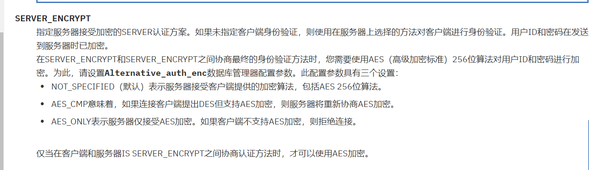
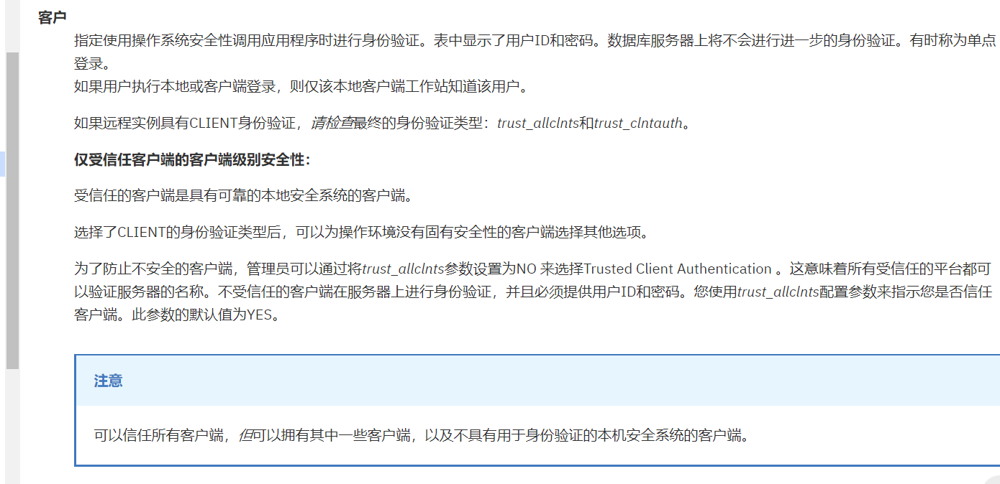
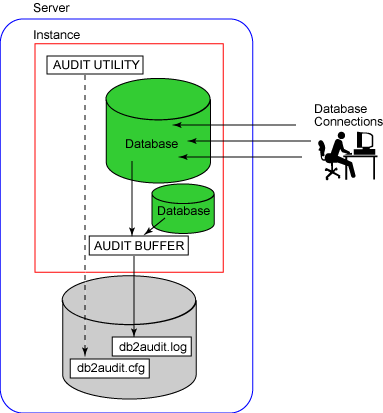
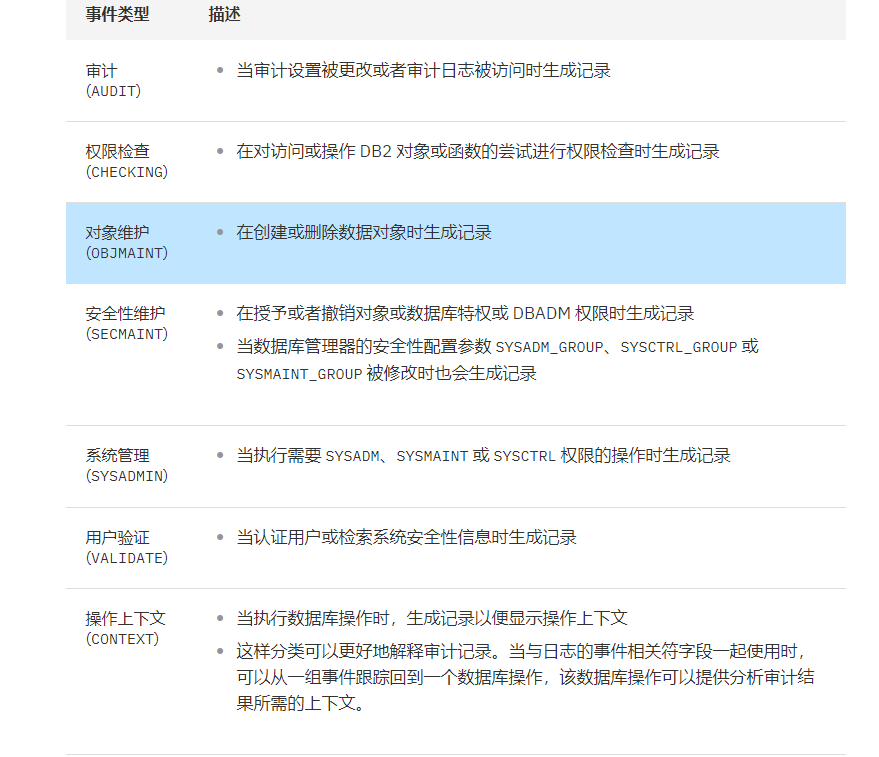
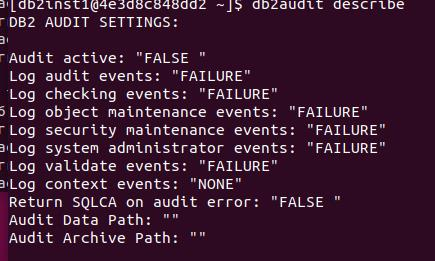

DB2
===

- 维护者

   - IBM

- 是否免费

   - DB2 Community Edition：免费&开源&受限

      - Memory limit: 16GB
      - Core limit: 4 cores

   - DB2：收费

   - DB2 on Cloud：常规云服务

- Latest Release

   - `Docker Hub <https://hub.docker.com/r/ibmcom/db2>`_

----

.. contents::

----

身份鉴别
--------

认证模型
~~~~~~~~

可从\ `IBM官网 <https://www.ibm.com/support/knowledgecenter/zh/SSEPGG_9.7.0/com.ibm.db2.luw.admin.sec.doc/doc/c0005435.html>`__\ 查询DB2的身份认证机制详解。DB2的认证方式保存在配置文件中，查看 ``AUTHENTICATION`` 相关的参数即可，主要身份认证方式如下：

-  ``SERVER`` （默认值） 将客户端输入的用户名和密码发送至服务器，由服务器的安全性机制（如PAM）进行认证以确定是否允许该用户访问实例。

.. hint::

   对于来自服务器的本地连接，当认证类型是 SERVER 时，不需用户标识和密码就可认证成功。

-  ``SERVER_ENCRYPT`` 同上，但客户端和服务器会先协商生成密钥，并对认证过程采用AES或DES方式加密（但不是基于SSL/TLS）。

|image1|

-  ``CLIENT``
   由客户端的安全性机制进行认证，可视为单点登录。根据服务器端trust_allclnts及trust_clntauth配置的不同，可以控制是否对客户端进行完全信任。

|image2|

.. list-table:: 认证主体
    :header-rows: 1

    * - TRUST_ALLCLNTS
      - TRUST_CLNTAUTH
      - 不可信非 DRDA® 客户机认证（没有用户标识和密码）
      - 不可信非 DRDA 客户机认证（具有用户标识和密码）
      - 可信非 DRDA 客户机认证（没有用户标识和密码）
      - 可信非 DRDA 客户机认证（具有用户标识和密码）
      - DRDA 客户机认证（没有用户标识和密码）
      - DRDA 客户机认证（有用户标识和密码）
    * - YES
      - CLIENT
      - CLIENT
      - CLIENT
      - CLIENT
      - CLIENT
      - CLIENT
      - CLIENT
    * - YES
      - SERVER
      - CLIENT
      - SERVER
      - CLIENT
      - SERVER
      - CLIENT
      - SERVER
    * - NO
      - CLIENT
      - SERVER
      - SERVER
      - CLIENT
      - CLIENT
      - CLIENT
      - CLIENT
    * - NO
      - SERVER
      - SERVER
      - SERVER
      - CLIENT
      - SERVER
      - CLIENT
      - SERVER
    * - DRDAONLY
      - CLIENT
      - SERVER
      - SERVER
      - SERVER
      - SERVER
      - CLIENT
      - CLIENT
    * - DRDAONLY
      - SERVER
      - SERVER
      - SERVER
      - SERVER
      - SERVER
      - CLIENT
      - SERVER

-  ``DATA_ENCRYPT`` 与 ``SERVER_ENCRYPT`` 类似，但会强制对整个通信进行加密。

-  ``DATA_ENCRYPT_CMP`` 与DATA_ENCRYPT类似，但提供了向下兼容性，允许客户端采用非加密方式通信。

-  ``KERBEROS`` and ``KERBEROS_SERVER_ENCRYPT`` 略

-  ``GSSPLUGIN`` AND ``GSS_SERVER_ENCRYPT`` 略（服务器级别第三方插件）

核查命令
~~~~~~~~

.. code-block:: bash

   # 在操作系统中核查配置
   db2 attach to db2apm

   # 核查配置
   db2 get dbm cfg | grep AUTHENTICATION

   -- 列出所有帐户
   -- SERVER认证方式下，可直接通过db2命令连接数据库并执行命令
   db2 "SELETE authid FROM sysibmadm.authorizationids WHERE authidtype = 'U'"

访问控制
--------

权限模型
~~~~~~~~

在DB2中，授权分为两个层次，一个是管理权限，另一个是对象权限（privilege）。管理权限是比较高层次的权限，包含实例的管理命令、数据库管理命令等。而特权则是低层次的针对某一个对象的访问权限。

有关权限的信息存储在系统编目表（SYSCAT）中，可以通过下面的语句看到所有的信息。

.. code-block:: bash

   db2 "SELECT SUBSTR(tabname, 1, 20) FROM syscat.tables WHERE tabschema='SYSCAT' AND tabname LIKE '%AUTH'"

管理权限
^^^^^^^^

在管理权限中包括两大类，一类是实例级的管理权限，另一类是数据库级的管理权限。管理权限的特点及命令如下表所示：

+----------------+----------+--------------------------+-------------------------+
|  管理权限类型  | 涉及权限 |           特点           |        授予方法         |
+================+==========+==========================+=========================+
| 实例级管理权限 | SYSADM   | 决定是否有权利进行特定的 | 在DBM CFG中有四个参数， |
|                |          |                          |                         |
|                | SYSCTRL  | 数据库管理工作，比如执行 | 需要把这四个参数设置成  |
|                |          |                          |                         |
|                |          | 备份恢复等操作。在这些权 | 操作系统的组，在组里的  |
|                |          |                          |                         |
|                | SYSMAINT | 限中SYSADM具有最大权限， | 用户自动获得相应的管理  |
|                |          |                          |                         |
|                | SYSMON   | 它不仅能进行实例管理工   | 权限。                  |
|                |          |                          |                         |
|                |          | 作，甚至包含了DBADM的权  |                         |
|                |          |                          |                         |
|                |          | 限，可以访问和操作数据库 |                         |
|                |          |                          |                         |
|                |          | 里的数据。               |                         |
+----------------+----------+--------------------------+-------------------------+
| 数据库管理权限 | DBADM    | 决定是否能对数据库数据进 | 使用GRANT把相应权限授予 |
|                |          |                          |                         |
|                |          | 行管理，创建数据库对象、 | 用户或者组。            |
|                |          |                          |                         |
|                | SECADM   | 导入等操作。SECADM负责数 |                         |
|                |          |                          |                         |
|                |          | 据库安全相关的操作，比如 |                         |
|                |          |                          |                         |
|                | LOAD     | 管理可信上下文和基于标签 |                         |
|                |          |                          |                         |
|                |          | 的访问控制（LBAC）。     |                         |
+----------------+----------+--------------------------+-------------------------+

除了管理权限，还有一些针对具体数据库对象的特权，这些特权也是通过GRANT和REVOKE语句授予和撤销的，授予对象可以是一个用户，一个用户组，或者全部用户（PUBLIC）。可通过下表看到创建或控制某个对象所需要的权限。

+----------------+------------------+------------------+-------------------+
|   数据库对象   | 重建对象所需权限 | 控制对象所需权限 | 与对象相关的权限  |
+================+==================+==================+===================+
| 数据库         | SYSADM           | DBADM            | CONNECT           |
|                |                  |                  |                   |
| （Database）   | SYSCTRL          |                  | BINDADD           |
|                |                  |                  |                   |
|                |                  |                  | CREATETAB         |
|                |                  |                  |                   |
|                |                  |                  | NOFENCE           |
|                |                  |                  |                   |
|                |                  |                  | IMPLICIT_SCHEMA   |
+----------------+------------------+------------------+-------------------+
| 包（Package）  | BINDADD          | CONTROL          | BIND              |
|                |                  |                  | EXECUTE           |
+----------------+------------------+------------------+-------------------+
| 表（Table）    | CREATEAB（表）   | CONTROL          | SELECT（表/视图） |
|                |                  |                  |                   |
| 视图（View）   | CONTROL（视图）  |                  | INSERT（表/视图） |
|                |                  |                  |                   |
|                | SELECT（视图）   |                  | DELETE（表/视图） |
|                |                  |                  |                   |
|                |                  |                  | UPDATE（表/视图） |
|                |                  |                  |                   |
|                |                  |                  | ALTER（表）       |
|                |                  |                  |                   |
|                |                  |                  | INDEX（表）       |
|                |                  |                  |                   |
|                |                  |                  | REFERENCES（表）  |
+----------------+------------------+------------------+-------------------+
| 索引（Index）  | INDEX            | CONTROL          | 无                |
+----------------+------------------+------------------+-------------------+
| 别名（Alias）  | 如果Schema       | CONTROL          | 无                |
|                | 不同于当前用户， |                  |                   |
|                |                  |                  |                   |
|                | 用户需要SYS      |                  |                   |
|                | ADM或DBADM权限   |                  |                   |
+----------------+------------------+------------------+-------------------+
| 模式（Schema） | SYSADM           | Schema的拥有者   | CREATEIN          |
|                |                  |                  |                   |
|                | DBADM            |                  | ALTERIN           |
|                |                  |                  |                   |
|                | IMPLICIT_SCHEMA  |                  | DROPIN            |
+----------------+------------------+------------------+-------------------+

核查命令
~~~~~~~~

.. code-block:: bash

   # DB2查看连接帐户权限
   db2 "SELECT * FROM syscat.dbauth WHERE GRANTEETYPE = 'U'"

运维命令
~~~~~~~~

.. code-block:: bash

   # 在操作系统层面，把SYSCTRL权限授予db2test帐户
   db2 update dbm cfg using SYSCTRL_GROUP group1
   db2stop
   db2start

.. code-block:: sql

   -- DBADM权限授予db2test
   GRANT DBADM ON DATABASE TO USER db2test;

   -- 撤销db2test用户的DBADM权限
   REVOKE DBADM ON DATABASE FROM USER db2test;

   -- 把EMPLOYEE表的SELECT权限授予HERON
   GRANT SELECT ON EMPLOYEE TO USER HERON;

   -- 撤销HERON的SELECT权限
   REVOKE SELECT ON EMPLOYEE FROM GROUP HERON;

安全审计
--------

审计概述
~~~~~~~~

DB2 UDB 审计功能是一件重要的安全性工具。它可以生成对一系列预定义的数据库事件的审计跟踪，并允许DBA维护审计跟踪。它可以对一些数据库事件，例如授权检查、数据库对象维护、安全性维护、系统管理和用户验证等做日志记录。可在\ `IBM官网 <https://www.ibm.com/support/knowledgecenter/zh/SSEPGG_9.7.0/com.ibm.db2.luw.admin.sec.doc/doc/c0050525.html>`__\ 获取审计功能的详细说明。

审计发生在实例级，为实例中的所有数据库服务。另外还有一个配置文件，用来设置审计选项。且审计功能必须单独启动和停止。例如，如果使用 ``db2stop`` 命令停止一个实例，那么审计功能不会自动停止；它必须单独使用 ``db2audit stop`` 命令来停止。 只有具有 ``SYSADM`` 权限的用户才能配置和使用审计功能。

启动审计功能后，生成的审计记录被写入到一个缓冲区，然后刷新到磁盘上的一个审计文件中。审计结束后，便可以将审计文件从它本地的原始格式转换成一种易读的文本文件。还可以将审计记录装载到 DB2 表中，以便于使用 SQL 查询数据和生成定制的报告。

审计功能的文件存储和维护在实例的 ``security`` 文件夹中。

|DB2 UDB 架构中的 DB2 审计功能|

审计对象
~~~~~~~~

`IBM官网 <https://www.ibm.com/developerworks/cn/data/library/techarticles/dm-0603wasserman/index.html>`__\ 提供了审计事件类型及审计对象的详细描述。安全管理员可以创建审计策略来控制在单个数据库内审计的内容。对于特定对象，只能有一个审计策略有效。例如，不能同时有多个审计策略与同一个表关联。审计策略不能与视图或类型表关联。根据基础表的策略，将审计访问具有关联审计策略的表的视图。

|image3|

-  整个数据库：根据审计策略，将审计该数据库内发生的所有可审计事件。

-  表：审计所有数据操作语言 (DML) 以及对表（无类型）、MQT（具体化查询表）或昵称的 XQUERY 访问。在访问表时，只生成包含或不包含数据的 EXECUTE 类别审计事件。

-  可信上下文：由特定可信上下文定义的可信连接内发生的所有可审计事件。

-  主体：审计由指定用户组或角色成员启动的所有可审计事件。

-  权限（SYSADM、SECADM、DBADM、SQLADM、WLMADM、ACCESSCTRL、DATAACCESS、SYSCTRL、SYSMAINT 和 SYSMON）审计由拥有指定权限的用户启动的所有可审计事件。

日志格式
~~~~~~~~

+------------+---------------+----------------------------------------+
|  **名称**  |   **格式**    |                **描述**                |
+============+===============+========================================+
| 时间戳     | CHAR(26)      | 审计事件的日期和时间                   |
+------------+---------------+----------------------------------------+
| 类别       | CHAR(8)       | 审计事件的类别。可能的值为：AUDIT      |
+------------+---------------+----------------------------------------+
| 审计事件   | CHAR(32)      | 特定的审计事件。可能的值包括：         |
|            |               |                                        |
|            |               | CONFIGURE、DB2AUD、EXTRACT             |
|            |               |                                        |
|            |               | FLUSH、PRUNE、START、STOP              |
|            |               |                                        |
|            |               | UPDATE_ADMIN_CFG                       |
+------------+---------------+----------------------------------------+
| 事件相关符 | INTEGER       | 被审计的操作的相关标识符。             |
|            |               |                                        |
|            |               | 可用于标识哪些审计记录与某个事件相关。 |
+------------+---------------+----------------------------------------+
| 事件状态   | INTEGER       | 审计事件的状态，由一个 SQLCODE         |
|            |               | 表示，其中：                           |
|            |               |                                        |
|            |               | -  成功的事件 >= 0                     |
|            |               | -  失败的事件 < 0                      |
+------------+---------------+----------------------------------------+
| 用户 ID    | VARCHAR(1024) | 审计事件发生时的用户 ID                |
+------------+---------------+----------------------------------------+
| 权限 ID    | VARCHAR(128)  | 审计事件发生时的权限 ID                |
+------------+---------------+----------------------------------------+

日志缓冲区
~~~~~~~~~~

审计记录通常首先被写入到一个内存缓冲区，然后才刷新到磁盘。为了防止缓冲时间过长，DB2 定时强制地写审计记录。还可以使用 ``db2audit flush`` 命令手动地刷新审计缓冲区。

缓冲区的大小是由 **AUDIT_BUF_SZ** 这个数据库管理器配置参数决定的。该参数指定为审计缓冲分配的 4K 大小的页面的数量。如果缓冲区的大小大于 0，那么审计记录是异步写的（可能导致丢失一定审计记录）。如果将缓冲区大小设置为 0，那么将发生同步写日志操作，而不使用审计缓冲区。

日志读取
~~~~~~~~

``db2audit.log`` 文件中的审计记录是以raw格式存储的。必须从该文件中将所有审计记录提取到一个文本文件中，然后才可以进行分析。也可以将审计记录提取到定界 ASCII 文件中。

可以使用 ``db2audit extract file <dest>`` 命令提取日志，并写入文本文件中。如果不指定一个文件名，那么这些记录将被写入到 ``$INSTHOME/sqllib/security/db2audit.out`` 文件中，其中 ``$INSTHOME`` 是实例的主目录。

也可以使用 ``db2audit extract delasc delimiter !`` 命令，将记录提取到定界 ASCII 文件，以便后续导入数据库表。

提取日志时，可以指定类型CATEGORY、数据库DATABASE、事件状态STATUS 参数，如：

.. code-block:: bash

   db2audit extract delasc delimiter ! category audit database sample status failure

核查命令
~~~~~~~~
.. code-block:: bash

   # 查看db2审计状态
   # 只有SYSADM权限的帐户可以使用该命令
   db2audit describe

|image4|

安全通信
--------

DB2支持配置通信SSL/TLS。\ `IBM官方文档 <https://www.ibm.com/support/knowledgecenter/zh/SSEPGG_9.7.0/com.ibm.db2.luw.admin.sec.doc/doc/c0005815.html>`__\ 有详细的配置方法。

配置成功后，可在DB2配置文件中查找SSL_SVR_KEYDB、SSL_SVR_STASH等参数，如果有内容即为启用了SSL。

