达梦
====

- 发行商

   - `武汉达梦数据库有限公司 <http://www.dameng.com/>`_

|image1|

----

.. contents::

----

配置
----

配置文件
~~~~~~~~

所有系统配置存放在 ``dm.ini`` 中，可直接通过vim等编辑器打开，默认位置在： ``/opt/dmdbms/data/DAMENG``。``dm.ini`` 中有一项配置 ``CONFIG_PATH`` ，可决定数据库启动时读取配置的位置。

可通过“DM控制台工具”可视化读取配置文件（同时可直接查看各配置的描述），可以通过该工具\ **修改配置文件**\ （不是修改系统运行参数），修改的参数在数据库重启后生效。

|image2|

.. important::

   当 ``dm.ini`` 中的某参数值设置为非法值时（比如设置密码长度参数非法时），系统的自动纠正策略如下：
   
   - 若设置值与参数类型不兼容，则参数实际取值为默认值；
   - 若设置值小于参数取值范围的最小值，则实际取值为最小值；
   - 若设置值大于参数取值范围的最大值，则实际取值为最大值。

配置读写相关系统函数
~~~~~~~~~~~~~~~~~~~~

读取函数共三个，函数名输入时无视大小写，分别用于读取整形、浮点型和字符型的参数值，读之前查查《DM系统管理员手册》。

``SF_GET_PARA_VALUE((int)scope, (varchar)ini_para_name)``

``SF_GET_PARA_DOUBLE_VALUE((int)scope, (varchar)ini_para_name)``

``SF_GET_PARA_STRING_VALUE((int)scope, (varchar)ini_para_name)``

其中， ``scope`` 参数1表示从 ``dm.ini`` 中读取，2表示读取运行状态。 ``ini_para_name`` 则为参数名。

|image3| |image4|

相应的，修改函数如下（注意函数名是SP）：

``SP_SET_PARA_VALUE((int)scope, (varchar)ini_para_name, (varchar)value)``

``SP_SET_PARA_DOUBLE_VALUE((int)scope, (varchar)ini_para_name, (varchar)value)``

``SP_SET_PARA_STRING_VALUE((int)scope, (varchar)ini_para_name, (varchar)value)``

此时 ``scope`` 参数1表示同时修改文件和运行状态，2表示仅修改文件。

|image5|

身份鉴别
--------

 ``sysusers`` 表为达梦数据库最重要的核查对象，记录每个帐户的密码复杂度、登录失败、加密密钥、口令、密码更换周期等。

|image6|

认证方式
~~~~~~~~

对应 ``sysusers`` 的 ``authent_type`` 列。

没法测试，DM开发版不支持配这个（只能选密码验证），但看《DM系统管理员手册》可以发现，就是Oracle的几种认证方式。

|image7|

|image8|

密码复杂度策略
~~~~~~~~~~~~~~

|image9|

全局参数对应 ``dm.ini`` 中的 ``PWD_POLICY`` ，取值为0-31（采用5位二进制数表示flag），其中各位flag的意义如下：

-  0： 无策略；

-  1： 禁止与用户名相同；

-  2： 口令长度不小于9；

-  4： 至少包含一个大写字母（A-Z）；

-  8 ：至少包含一个数字（0－9）；

-  16：至少包含一个标点符号（不得输入半角引号和空格）

若为其他数字，则表示配置值的和，如3表示同时启用第1项和第2项策略。

``dm.ini`` 中还有一个 ``PWD_MIN_LEN`` ，仅当PWD_POLICY中的第二位未设置时才生效，用于单独控制密码长度（有效值为9-32）。

|image10|

.. important::

   新建用户时遵循系统的密码复杂度参数，但修改用户时，实际校验的是 ``sysusers`` 表中该用户的 ``pwd_policy`` 参数，因此要注意核查每个用户的对应参数。

此外，测试时使用开发版dm，不支持给每个用户设置独立的密码策略，也不支持修改用户密码策略。但查询《DM系统管理员手册》发现，应该至多可以设置5种不同的密码策略，这个密码策略写在 ``pwd_policy`` 列里（但实际发现这里写着0-31的flag串）。

|image11|

|image12|

登录失败和连接超时
~~~~~~~~~~~~~~~~~~

没啥说的，对应 ``sysusers`` 中的 ``FAILED_NUM`` 、 ``LOCK_TIME`` 、 ``CONN_IDLE_TIME`` （ ``FAILED_ATTEMPS`` 可能指之前发生的失败次数）。可以直接GUI右键用户修改。

|image14|

可使用一句话命令核查：

|image15|

登录地址限制
~~~~~~~~~~~~

好像不能通过GUI配置，只能通过SQL：

.. code-block:: sql

   ALTER USER 123 NOT_ALLOW_IP "1.1.1.1";

|image16|

可使用一句话命令核查 ``sysuser`` 表中的 ``allow_addr`` 和 ``not_allow_addr`` 列：

|image17|

核查命令
~~~~~~~~

.. code-block:: sql 

   -- 一句话查询口令复杂度和周期
   SELECT USERNAME, s.PASSWORD, AUTHENT_TYPE, PWD_POLICY, LIFE_TIME, REUSE_TIME, REUSE_MAX, GRACE_TIME 
   FROM SYS.SYSUSERS s, DBA_USERS d 
   WHERE ACCOUNT_STATUS = 'OPEN' AND s.ID = d.USER_ID;

   -- 一句话查询登录失败锁定和超时
   SELECT USERNAME, FAILED_NUM, LOCK_TIME, CONN_IDLE_TIME 
   FROM SYS.SYSUSERS s, DBA_USERS d 
   WHERE ACCOUNT_STATUS = 'OPEN' AND s.ID = d.USER_ID;

   -- 一句话查询登录地址限制
   SELECT USERNAME, ALLOW_ADDR, NOT_ALLOW_ADDR FROM SYS.SYSUSERS 
   WHERE ACCOUNT_STATUS = 'OPEN' AND s.ID = d.USER_ID;

运维命令
~~~~~~~~

GUI配置
^^^^^^^

“DM管理工具”的用户模块可以可视化管理用户

|image18|

新建用户时，可以配置图中的各项参数，就是对应了 ``sysusers`` 表中的各个列，如果密码不满足系统的复杂度要求，则会报错。

|image19|

修改用户时，不是点击右键-属性，而是点击右键-修改。

|image20|

SQL配置
^^^^^^^

《DM_SQL语言使用手册》第70页

|image21|

|image22|

访问控制
--------

DM8出厂时，预置几个用户

-  管理用户：SYSDBA

-  审计用户：SYSAUDITOR

-  安全用户：SYSSSO

-  系统用户：SYS

默认情况下，只有对应角色的管理用户才能创建其他用户，如审计角色的管理员可创建新的审计帐户。

|image23|

安全审计
--------

注意dm参数中的 ``ENABLE_AUDIT`` ，只有审计员可操作。

|image24|

日志信息存放在 ``SYSAUDITOR.SYSAUDIT`` 中，只有审计员可查看。

|image25|

入侵防范
--------

GUI下，通过“DM服务查看器”可管理数据库启用的服务，Windows操作系统的话直接去服务里面看。未找到命令行的调用方式。

|image26|

安全通信
--------

关注dm参数中的 ``ENABLE_ENCRYPT`` 。

|image27|

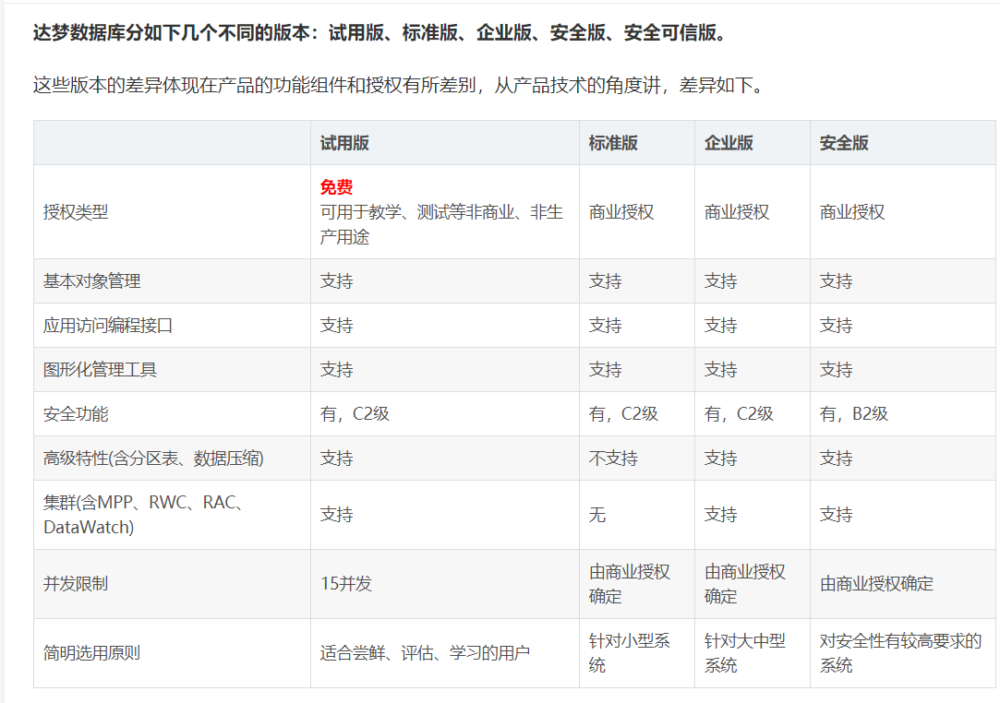
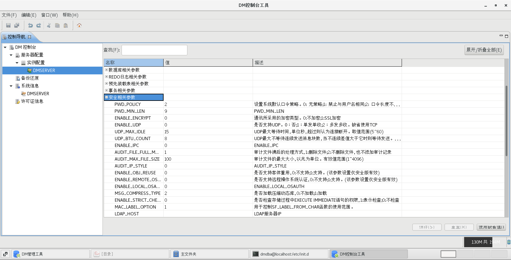
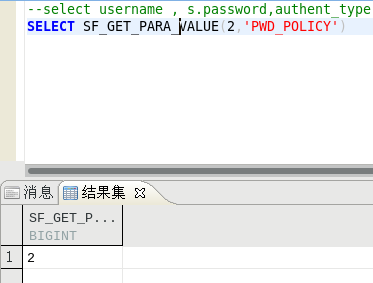
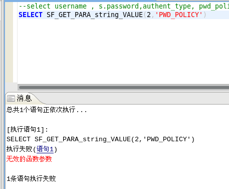
.. |image5| image:: media/dm/image5.png
   :width: 3.04193in
   :height: 3.22528in
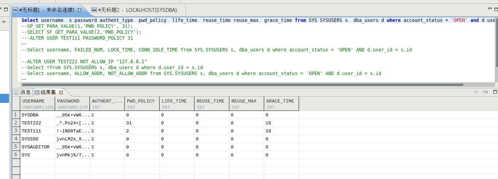
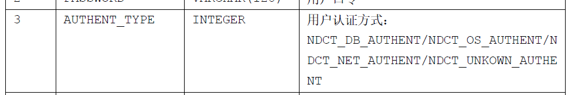
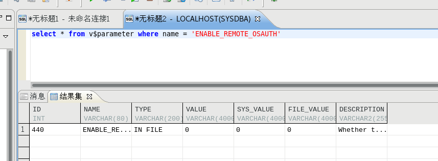
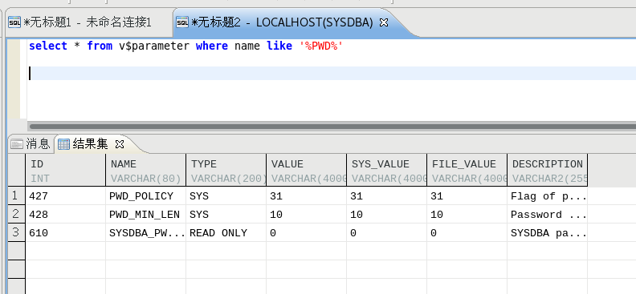
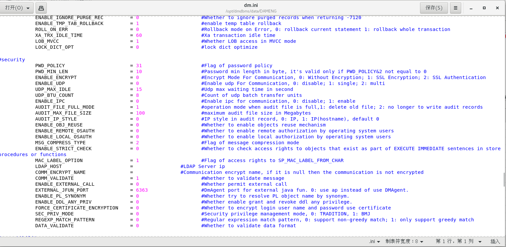
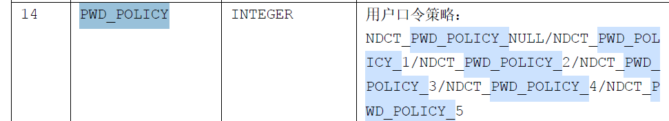
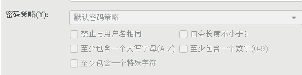
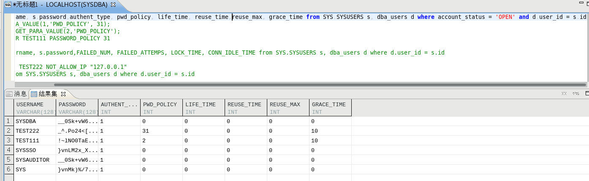
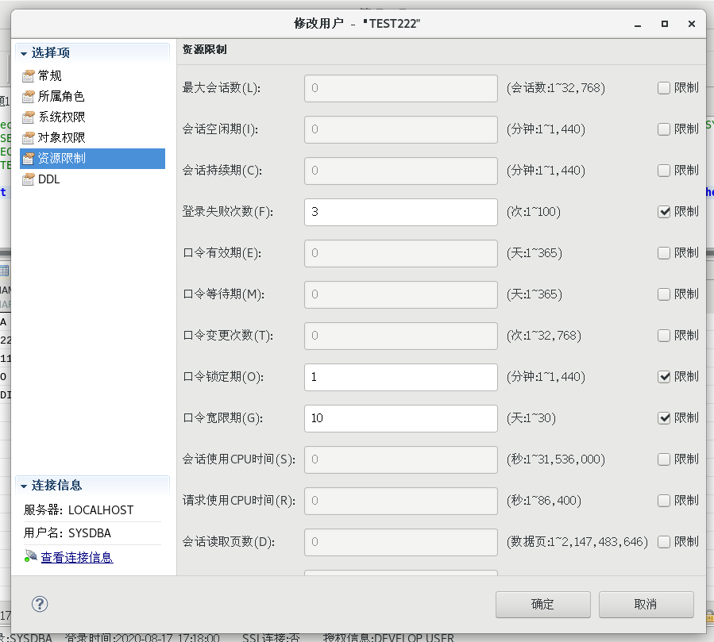
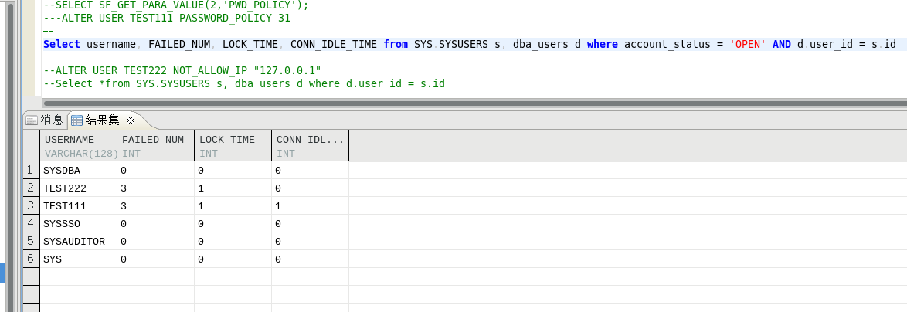
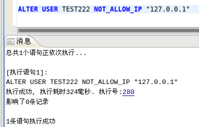
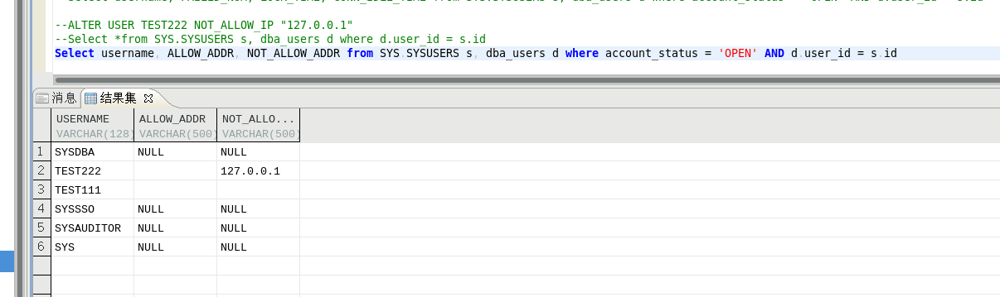
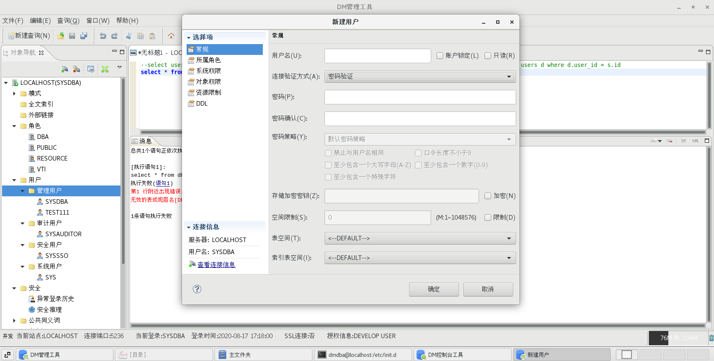
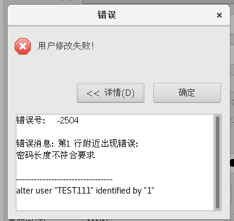
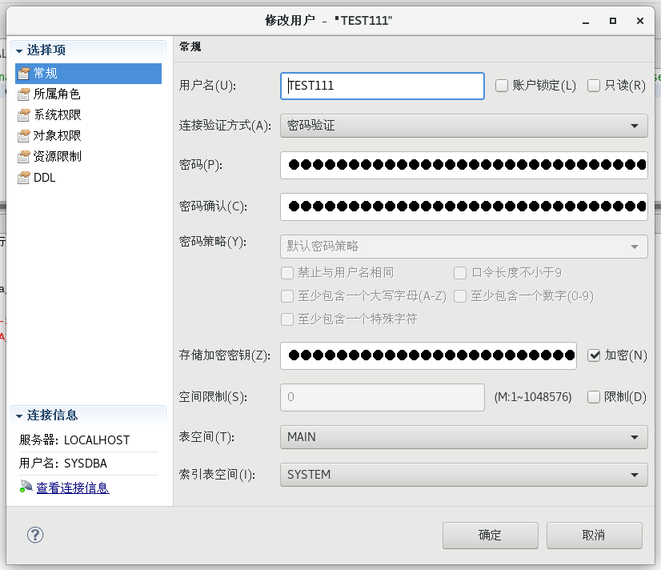
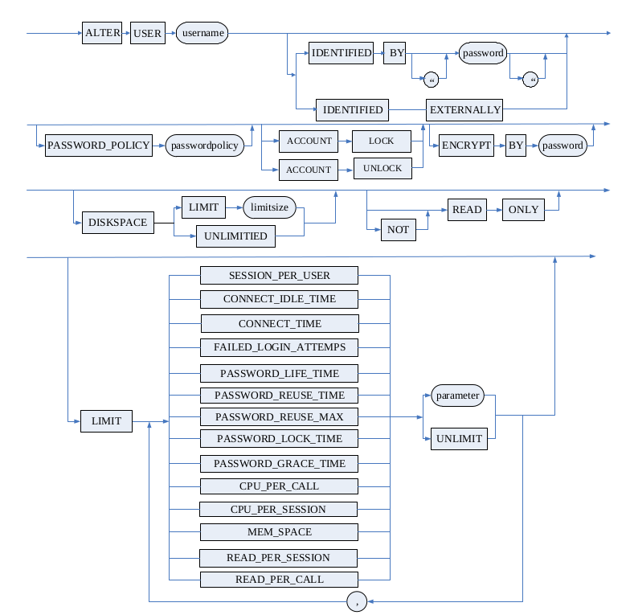
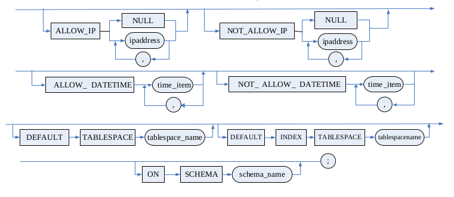
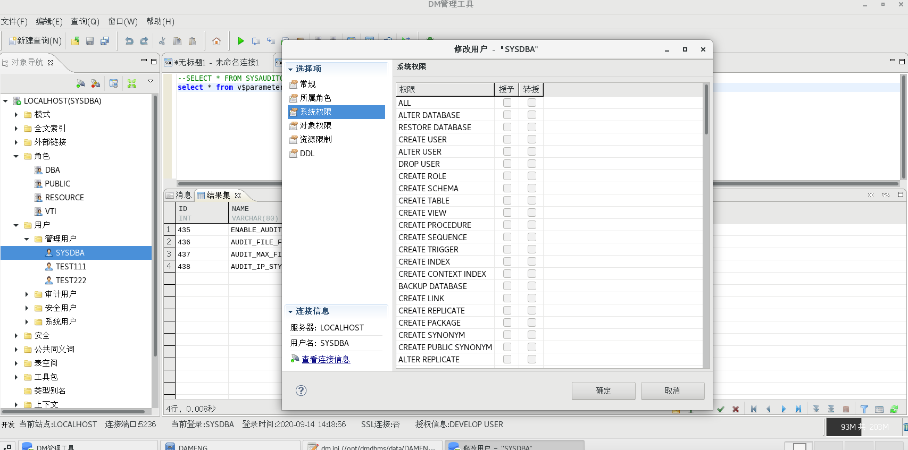
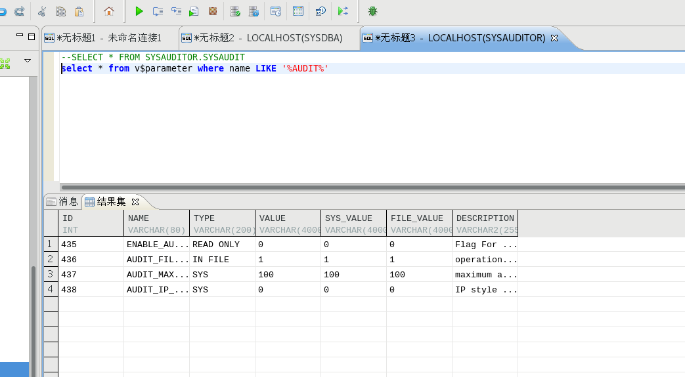
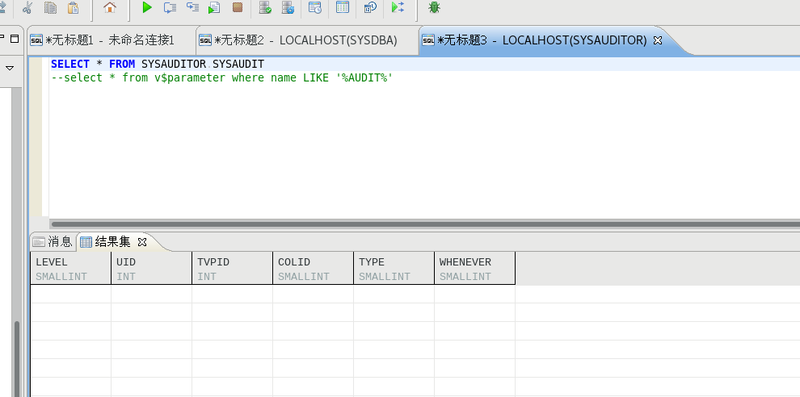
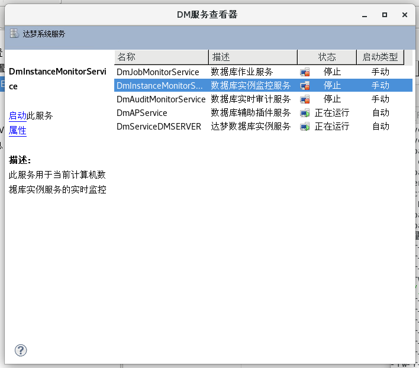
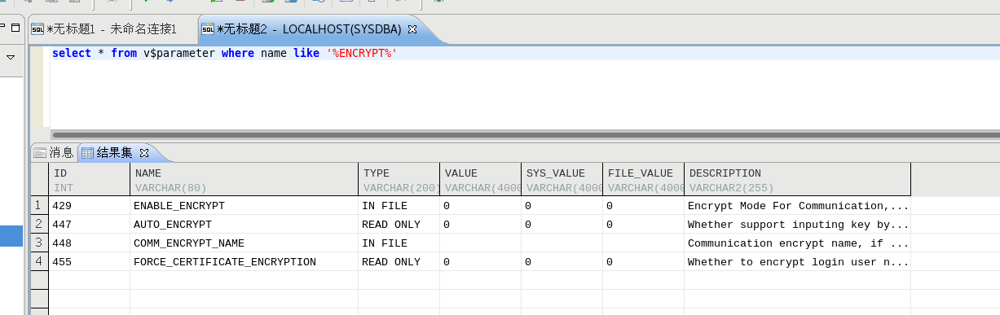
