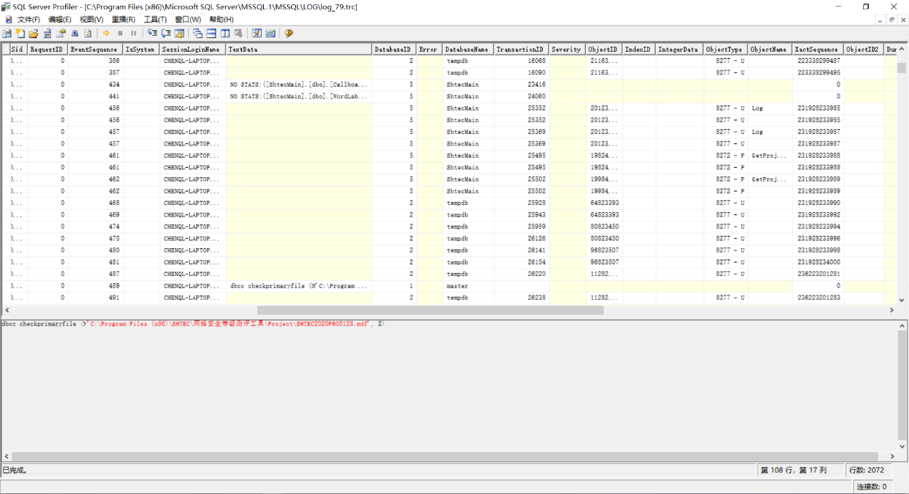

MSSQL
=====

- 发行商

   - Microsoft

- 是否免费

   - SQL Server Express：免费&受限

      - Up to 1 physical processor
      - Up to 1 GB memory
      - Up to 10 GB storage

   - SQL Server：收费

   - Azure：收费（常规云服务）

- Latest Service Packs (SP) and Cumulative Updates (CU)

   - `blogspot <https://sqlserverbuilds.blogspot.com/>`_

----

.. contents::

----

身份鉴别
--------

认证模型
~~~~~~~~

SQL Server 2016及以前的版本只可在Windows操作系统中安装。从2017版本开始，SQL Server同时提供了Windows版和Linux版。在各数据库实例的服务器属性中，可查看该实例启用的身份验证模式。常见的MSSQL认证方式如下：

-  Windows认证：（仅Windows版）使用NTS机制，使用有效的Windows操作系统帐户或AD域帐户登录后，可直接连接数据库。

-  SQL Server认证：使用数据库的登录名及口令进行认证。

|image1|

MSSQL将“帐户”的概念拆分成两部分，分别为服务器级别的登录名和数据库级别的用户。其中服务器级别的登录名决定用户是否能够连接数据库实例（身份鉴别功能），数据库级别的用户决定是否能够访问对应数据库（访问控制功能）。每个数据库有自己独立的用户，可在服务器级别的登录名和各数据库级别的用户之间建立映射关系，实现精确到数据库级别的访问控制。

显然地，只有服务器级别的登录名需要设置用户名和口令，同时鉴别信息复杂度策略和定期更换策略也针对服务器级别的登录名。

.. important::

   - 在Windows认证的情况下，登录名中实际设置了Windows操作系统的帐户名或用户组，如 ``BUILTIN\Administrators`` 、 ``BUILTIN\Users`` ，用于实现Windows操作系统与登录名的映射。

   - 为了满足等保要求，应删除类似于 ``BUILTIN\Users`` 的用户组，仅保留必要的操作系统帐户。

|image2|

对于每个登录名，有两个设置与是否允许登录相关：

-  是否允许连接到数据库引擎(connect) 。设置deny
   connect对服务器sysadmin角色的登录名无效。

-  是否启用登录(login)。设置deny login对所有登录名均有效。

|image3|

口令策略
~~~~~~~~

MSSQL可为每个登录名独立开启鉴别信息复杂度策略和口令过期策略。

-  强制实施密码策略

   -  Windows版：引用本地安全策略中的“密码必须符合复杂性要求”、“密码长度最小值”、“帐户锁定阈值”、“帐户锁定时间”。（设置了弱策略也引用）

   -  Linux版：口令不得包含用户名，密码最少为8个字符，必须包含三种元素。\ **无登录失败处理功能**\ 。

-  强制密码过期

   -  Windows版：引用本地安全策略中的“密码最长使用期限”。

   -  Linux版：\ **勾选无效**\ 。（无该功能）

|image4|

连接超时
~~~~~~~~

|image5|

.. hint::

   MSSQL没有空闲会话超时的功能。

核查命令
~~~~~~~~

.. code:: sql

   -- 查看用户是否设置口令及口令策略
   -- is_policy_checked 强制实施密码策略（1启用）
   -- is_expiration_checked：强制密码过期
   SELECT name, type_desc, CASE PWDCOMPARE('',password_hash) WHEN 1 THEN 'null' ELSE 'not_null' END AS PASSWORD, is_policy_checked, is_expiration_checked
   FROM sys.sql_logins
   WHERE is_disabled = 0;

   -- 查看登录超时
   sp_configure 'remote login time';

|image6|

访问控制
--------

权限模型
~~~~~~~~

微软官方提供一个\ `PDF文件 <https://aka.ms/sql-permissions-poster>`__\ ，描述SQL
Server整体的权限模型。SQL Server的权限共4个等级：服务器级>数据库级>架构级>对象级。

.. hint::
   1. 这份文件啃下来就可以出去吹牛了。
   2. 下面全是对这份文件的解释。

服务器级
^^^^^^^^

服务器级的权限主要通过服务器角色（如sysadmin角色）来控制，这些服务器角色预置在SQL Server中且不能修改。每个登录名可绑定一个或多个服务器角色，可视为RBAC的权限分配模型。

一般而言，服务器角色都具有一些强大的全局权限，在赋权时需要格外谨慎。如果没有特殊需求，对登录名分配public服务器角色即可。public的默认权限为 ``VIEW ANY DATABASE`` （列出数据库）及 ``CONNECT`` 。

|image7|

数据库级
^^^^^^^^

对SQL
Server数据库而言，登录名不能直接访问数据库对象，它需要和被访问数据库的数据库用户进行映射，然后使用数据库用户的权限来进行操作。实际上，数据库级以及其下属的架构级、对象级的权限主体均为数据库用户。SQL Server通过这个机制，可实现同一个登录名具备不同数据库的不同权限。在各登录名的“映射数据库”中可以看到开启映射的数据库，映射的对应数据库用户，以及数据库用户的数据库级别角色。

.. hint::

   每个数据库有一个隐藏guest用户，默认不具备任何权限。如果登录名使用 ``USE database`` 语句访问的数据库中没有设置映射，此登录名就与guest用户相关联。

|image8|

SQL Server具有数据库角色的概念，其作用域为当前数据库。数据库角色用于控制各数据库用户对数据库的读写行为，其粒度达到整个数据库的增删改查的级别（相对权限还是较高）。微软预置了一些常见角色，此外数据库管理员可根据实际需求自行创建新的数据库角色。

+-------------------+-------------------------------------------------+
| 数据库角色        | 说明                                            |
+===================+=================================================+
| db_owner          | 数据库完全控制权，可以执                        |
|                   | 行数据库的所有配置和维护活动，可以删除数据库。  |
+-------------------+-------------------------------------------------+
| db_securityadmin  | 可以修改自定义角色的角色成员资格和管理权限。    |
+-------------------+-------------------------------------------------+
| db_accessadmin    | 可以为登录名添加或删除数据库访问权限。          |
+-------------------+-------------------------------------------------+
| db_backupoperator | 可以备份数据库。                                |
+-------------------+-------------------------------------------------+
| db_ddladmin       | 可以在数据库中运行任何数据定义语言 (DDL) 命令。 |
+-------------------+-------------------------------------------------+
| db_datawriter     | 可以在所有用户表中添加、删除或更改数据。        |
+-------------------+-------------------------------------------------+
| db_datareader     | 可以从所有用户表中读取所有数据。                |
+-------------------+-------------------------------------------------+
| db_denydatawriter | 不                                              |
|                   | 能添加、修改或删除数据库内用户表中的任何数据。  |
+-------------------+-------------------------------------------------+
| db_denydatareader | 不能读取数据库内用户表中的任何数据。            |
+-------------------+-------------------------------------------------+
| public（隐藏）    | 不具备                                          |
|                   | 任何权限。（所有数据库用户默认具有public角色）  |
+-------------------+-------------------------------------------------+

架构级
^^^^^^

微软推荐在架构级别进行权限控制。数据库架构包含一组数据库对象，如表、视图和存储过程，可以理解为数据库内的名空间。不同的架构中，表、视图和存储过程可以重名。在创建数据库表的时候，必须要给它指定一个架构（可以使用自定义架构），不指定时默认使用dbo架构。

每个数据库架构必须设置属主，属主具有数据库架构的完全控制权，且优先级高于数据库级角色。默认情况下，创建数据库用户时自动创建一个同名架构，并指定其为架构属主，之后可以手动设置架构属主为某一个数据库角色或者某一个独立数据库用户。如果设置架构数据为数据库角色，则该角色下属的所有数据库用户均视为该架构的属主。

.. note::

   权限举例：用户A被赋予 ``db_denydatareader`` 角色（无法读数据库内容），同时被赋予架构B的属主，那么用户A能够对架构B中的表/视图/存储过程进行读写，但不能对数据库中的其他内容进行读。

|image9|

默认情况下，数据库角色 ``public`` 不拥有任何架构。可以根据业务需求，将部分公用表/存储过程放在一个公用架构中，并赋予 ``public`` ，实现数据的公用。

|image10|

数据库对象的调用链
^^^^^^^^^^^^^^^^^^

``SELECT * FROM [db_name].[schema_name].[object_name]``

其中，新建数据库连接时，可以设置“默认数据库”参数，作用为：当 ``[db_name]`` 缺省时，使用该参数自动填入。

此外，新建[登录名->数据库用户]映射时，可以设置“默认架构”参数，作用为：当 ``[schema_name]`` 缺省时，使用该参数自动填入。

隐式继承
~~~~~~~~

SQL Server 的权限具有隐式继承关系：

1、Control类权限隐式继承。如：当一个登录名被赋予sysadmin（或被显式赋予 ``Control Server`` 权限），则其自动获得所有数据库、架构和对象的Control权限。

2、Select/Update/Insert/Delete/Execute/View等权限隐式继承。如：当一个数据库用户被授予 ``Select`` 权限，则其自动获得数据库下所有架构和对象的Select权限。

|image11|

.. important:: 

   测评时需要着重注意系统Control权限的分配，应做到最小化。如果无法避免分配Control权限，应在必要时显式阻止Control的继承。默认情况下，如果不加阻止的话，所有sysadmin角色的登录名都具有所有数据库的控制权。

显式赋权
~~~~~~~~

SQL
Server提供了“安全对象”功能，可视为DAC。优先级为“显式赋权（安全对象）> 隐式继承（内置角色）”。

数据库中的每个对象都具有“安全对象”的标签（如：登录名-属性-安全对象），可以精细化控制访问策略。如：

-  在服务器层面新建登录名，并赋予更改任意服务器审核的权限，就可以赋予该登录名审计日志设置和查看权限，也就是可以作为安全审计员。

-  在各业务数据库层面拒绝sa的 ``Control Database`` 权限，sa就失去了对应数据库及子对象的Control权限。

|image12|

核查命令
~~~~~~~~

.. code:: sql

   -- 查看服务器角色列表
   EXEC sp_helpsrvrole;

   -- 查看服务器角色的所有权限（两者皆可）
   SELECT * 
   FROM sys.fn_builtin_permissions('SERVER') 
   ORDER BY permission_name;
   EXEC sp_srvrolepermission;
   
   -- 查看服务器角色成员信息
   EXEC sp_helpsrvrolemember;
   SELECT * FROM sys.server_role_members;

   -- 查看某数据库角色或数据库用户拥有的架构：
   SELECT * 
   FROM sys.schemas 
   WHERE principal_id = DATABASE_PRINCIPAL_ID('public')

运维命令
~~~~~~~~

.. code:: sql

   -- 创建登录名
   CREATE LOGIN loginName WITH PASSWORD = 'pass';

   -- 打开数据库
   USE databaseName;
   -- 创建登录名与数据库用户的映射
   CREATE userName FOR LOGIN loginName;
   -- 新建数据库角色
   CREATE ROLE ProgramerRole;
   -- 将用户添加到角色中
   EXEC sp_addrolemember 'ProgramerRole', 'userName';

   -- 授予角色创建表、创建存储过程、创建视图的权限
   GRANT CREATE TABLE, CREATE PROCEDURE, CREATE VIEW TO ProgramerRole;

   -- 授予角色dbo架构的权限
   -- EXECUTE和ALTER用于执行、修改、删除存储过程
   GRANT SELECT, INSERT, EXECUTE, ALTER ON schema::dbo TO ProgramerRole;

安全审计
--------

内置错误日志
~~~~~~~~~~~~

MSSQL默认开启着错误日志，位置在“服务器-管理-SQL Server日志”中。内容如下：

-  SQL SERVER 的启动参数，以及认证模式，内存分配模式。

-  每个数据库是否能够被正常打开。如果不能，原因是什么

-  数据库损坏相关的错误

-  数据库备份与恢复动作记录

-  DBCC CHECKDB记录

-  内存相关的错误和警告

-  SQL调度出现异常时的警告。一般SERVER Hang 会伴随着有这些警告

-  SQL I/O操作遇到长时间延迟的警告

-  SQL在运行过程中遇到的其他级别比较高的错误

-  SQL内部的访问越界错误（Access Violation）

-  SQL服务关闭时间

-  SQL SERVER版本，以及windows和processor基本信息。

|image13|

默认状态下，错误日志会在 ``MSSQL/LOG`` 文件夹中存放7个。在日志文件达到大小上限或服务器重启时，自动进行一次rotate。可在数据库中执行 ``EXEC sp_cycle_errorlog`` （仅服务器角色sysadmin具有权限），强制进行一次日志rotate。

默认审核跟踪
~~~~~~~~~~~~

SQL Server 2005之后引入默认审核跟踪策略，针对重要事件进行审核跟踪。日志属性为：事件、用户、主机名、事件ID、登录名、时间、数据库名、对象名、服务器级别日志详细信息。但默认审核跟踪的日志文件只记录5个，每个文件大小最大为20M，且不允许修改配置。在“数据库-Facets-服务器审核-DefaultTraceEnabled”可以查看默认审核跟踪的状态。

审核跟踪日志将写入 ``$程序目录\mssql\data`` 或 ``$程序目录\mssql$instancename\data`` ，文件名的格式为 ``audittrace_yyyymmddhhmmss.trc`` 。可通过 ``::fn_trace_gettable('/path/to/log.trc', default)`` 装载日志文件。

|image14|

微软提供SQL Server Profiler工具，可用于查看数据库的审核跟踪文件。在SQL Server
Management Studio的工具菜单中也有SQL Server Profiler的快捷方式。

|image15|

|image16|

自定义审核规范
~~~~~~~~~~~~~~

SQL Server
2008开始引入了自定义审核规范功能及自定义审核的功能，管理员可根据实际业务需求自行设置审核策略，不再需要在C2审核跟踪和默认审核跟踪之间二选一。自定义审核需要依次在服务器中设置两个参数，其中：

-  在实例级安全选项和数据库级安全选项分别设置“审核规范”，用于指定审核的对象及类型。

-  在实例级安全选项中设置“审核”，用于设置审核是否启用、审核文件存放路径、审核文件大小限制、审核日志写入失败时的动作（生产环境不得选“关闭服务器”）。

|image17|

|image18|

审核策略清单
^^^^^^^^^^^^

+----------------------------------+----------------------------------+
| 事件                             | 说明                             |
+==================================+==================================+
| APPLIC                           | 更改应用程序角色的密码           |
| ATION_ROLE_CHANGE_PASSWORD_GROUP |                                  |
+----------------------------------+----------------------------------+
| AUDIT_CHANGE_GROUP               | 创建、修改或删除任何审核时       |
+----------------------------------+----------------------------------+
| BACKUP_RESTORE_GROUP             | 发出备份或还原命令时             |
+----------------------------------+----------------------------------+
| BATCH_COMPLETED_GROUP            | 每当任何批处理文本、存储过程     |
|                                  | 或事务管理操作执行完成时触发事件 |
+----------------------------------+----------------------------------+
| BATCH_STARTED_GROUP              | 每当任何批                       |
|                                  | 处理文本、存储过程或事务管理操作 |
+----------------------------------+----------------------------------+
| BROKER_LOGIN_GROUP               | 报告与 Service Broker            |
|                                  | 传输安全性相关的审核消息（等效于 |
|                                  | Audit Broker Login Event Class） |
+----------------------------------+----------------------------------+
| DATABASE_CHANGE_GROUP            | 创建、更改或删除数据库时         |
+----------------------------------+----------------------------------+
| DATABASE_LOGOUT_GROUP            | 在包含数据库用户注销某一数据库时 |
+----------------------------------+----------------------------------+
| DATABASE_MIRRORING_LOGIN_GROUP   | 报告与数                         |
|                                  | 据库镜像传输安全性相关的审核消息 |
+----------------------------------+----------------------------------+
| DATABASE_OBJECT_ACCESS_GROUP     | 访问数据库                       |
|                                  | 对象（如消息类型、程序集和协定） |
+----------------------------------+----------------------------------+
| DATABASE_OBJECT_CHANGE_GROUP     | 针对数据库对象执行 CREATE、ALTER |
|                                  | 或 DROP 语句时                   |
+----------------------------------+----------------------------------+
| DATABA                           | 在数据库范围内更改对象所有者时   |
| SE_OBJECT_OWNERSHIP_CHANGE_GROUP |                                  |
+----------------------------------+----------------------------------+
| DATABAS                          | 针对数据库对象发出 GRANT、REVOKE |
| E_OBJECT_PERMISSION_CHANGE_GROUP | 或 DENY 语句时                   |
+----------------------------------+----------------------------------+
| DATABASE_OPERATION_GROUP         | 对于任何数据库的任何操作时       |
+----------------------------------+----------------------------------+
| DATABASE_OWNERSHIP_CHANGE_GROUP  | 使用 ALTER AUTHORIZATION         |
|                                  | 语句更改数据库的所有者时（等效于 |
|                                  | Audit Change Database Owner      |
|                                  | Event Class）                    |
+----------------------------------+----------------------------------+
| DATABASE_PERMISSION_CHANGE_GROUP | SQL Server                       |
|                                  | 中的任何主体针对某语句权限发出   |
|                                  | GRANT、REVOKE 或 DENY            |
|                                  | 语句时（等效于 Audit Database    |
|                                  | Scope GDR Event Class）          |
+----------------------------------+----------------------------------+
| DATABASE_PRINCIPAL_CHANGE_GROUP  | 在数据库中创建、更               |
|                                  | 改或删除主体（如用户）时（等效于 |
|                                  | Audit Database Principal         |
|                                  | Management Event Class、Audit    |
|                                  | Add DB Principal）               |
+----------------------------------+----------------------------------+
| DATABA                           | 数据库范围内存在模拟操作（如     |
| SE_PRINCIPAL_IMPERSONATION_GROUP | EXECUTE AS <principal> 或        |
|                                  | SETPRINCIPAL）时                 |
+----------------------------------+----------------------------------+
| D                                | 向数据库                         |
| ATABASE_ROLE_MEMBER_CHANGE_GROUP | 角色添加登录名或从中删除登录名时 |
+----------------------------------+----------------------------------+
| DBCC_GROUP                       | 主体发出任何 DBCC 命令时         |
+----------------------------------+----------------------------------+
| FAIL                             | 某个主体尝试登录到数据库并且失败 |
| ED_DATABASE_AUTHENTICATION_GROUP |                                  |
+----------------------------------+----------------------------------+
| FAILED_LOGIN_GROUP               | 主体尝试登录到 SQL Server        |
|                                  | ，但是失败                       |
+----------------------------------+----------------------------------+
| FULLTEXT_GROUP                   | 发生了全文搜索事件               |
+----------------------------------+----------------------------------+
| LOGIN_CHANGE_PASSWORD_GROUP      | 通过 ALTER LOGIN 语句或          |
|                                  | sp_password                      |
|                                  | 存储过程更改登录密码时           |
+----------------------------------+----------------------------------+
| LOGOUT_GROUP                     | 指示主体已注销 SQL               |
|                                  | Server（等效于 Audit Logout      |
|                                  | Event Class）                    |
+----------------------------------+----------------------------------+
| SCHEMA_OBJECT_ACCESS_GROUP       | 每                               |
|                                  | 次在架构中使用对象权限时（等效于 |
|                                  | Audit Schema Object Access Event |
|                                  | Class）                          |
+----------------------------------+----------------------------------+
| SCHEMA_OBJECT_CHANGE_GROUP       | 针对架构执行 CREATE、ALTER 或    |
|                                  | DROP 操作时                      |
+----------------------------------+----------------------------------+
| SCHE                             | 检查更改架构对象的所有者的权限时 |
| MA_OBJECT_OWNERSHIP_CHANGE_GROUP |                                  |
+----------------------------------+----------------------------------+
| SCHEM                            | 对架构对象执行 GRANT、DENY 或    |
| A_OBJECT_PERMISSION_CHANGE_GROUP | REVOKE 语句时                    |
+----------------------------------+----------------------------------+
| SERVER_OBJECT_CHANGE_GROUP       | 针对服务器对象执行 CREATE、ALTER |
|                                  | 或 DROP 操作时                   |
+----------------------------------+----------------------------------+
| SERV                             | 服务                             |
| ER_OBJECT_OWNERSHIP_CHANGE_GROUP | 器范围中的对象的所有者发生更改时 |
+----------------------------------+----------------------------------+
| SERVE                            | 任何主体针对某服务器对象权限发出 |
| R_OBJECT_PERMISSION_CHANGE_GROUP | GRANT、REVOKE、或 DENY 语句时    |
+----------------------------------+----------------------------------+
| SERVER_OPERATION_GROUP           | 使用安全审核操作（如使更         |
|                                  | 改设置、资源、外部访问或授权）时 |
+----------------------------------+----------------------------------+
| SERVER_PERMISSION_CHANGE_GROUP   | 针对获取服务器范围内的权限而发出 |
|                                  | GRANT、REVOKE 或 DENY 语句时     |
+----------------------------------+----------------------------------+
| SERVER_PRINCIPAL_CHANGE_GROUP    | 创建                             |
|                                  | 、更改或删除服务器主体时（等效于 |
|                                  | Audit Login GDR Event Class）    |
+----------------------------------+----------------------------------+
| SERV                             | 服务器范围内发生模拟（如 EXECUTE |
| ER_PRINCIPAL_IMPERSONATION_GROUP | AS <login>）时                   |
+----------------------------------+----------------------------------+
| SERVER_ROLE_MEMBER_CHANGE_GROUP  | 向固定服务器角色添加             |
|                                  | 登录名或从中删除登录名时（等效于 |
|                                  | Audit Add Login to Server Role   |
|                                  | 事件类）                         |
+----------------------------------+----------------------------------+
| SERVER_STATE_CHANGE_GROUP        | 修改 SQL Server 服务状态时       |
+----------------------------------+----------------------------------+
| SUCCESSF                         | 指示主体已成功登录到数据库       |
| UL_DATABASE_AUTHENTICATION_GROUP |                                  |
+----------------------------------+----------------------------------+
| SUCCESSFUL_LOGIN_GROUP           | 指示主体已成功登录到 SQL Server  |
+----------------------------------+----------------------------------+
| TRACE_CHANGE_GROUP               | 检查 ALTER TRACE 权限的所有语句  |
+----------------------------------+----------------------------------+
| TRANSACTION_GROUP                | 由 BEGIN TRANSACTION、ROLLBACK   |
|                                  | TRANSACTION 和 COMMIT            |
|                                  | TRANSACTION操作引发              |
+----------------------------------+----------------------------------+
| USER_CHANGE_PASSWORD_GROUP       | 使用 ALTER USER                  |
|                                  | 语句更改数据库用户的密码时       |
+----------------------------------+----------------------------------+
| USER_DEFINED_AUDIT_GROUP         | 使用 自定义的sp_audit_write      |
|                                  | (Transact-SQL) 引发              |
+----------------------------------+----------------------------------+
| SELECT                           | 发出 SELECT 语句时               |
+----------------------------------+----------------------------------+
| UPDATE                           | 发出 UPDATE 语句时               |
+----------------------------------+----------------------------------+
| INSERT                           | 发出 INSERT 语句时               |
+----------------------------------+----------------------------------+
| DELETE                           | 发出 DELETE 语句时               |
+----------------------------------+----------------------------------+
| EXECUTE                          | 发出 EXECUTE 语句时              |
+----------------------------------+----------------------------------+
| RECEIVE                          | 发出 RECEIVE 语句时              |
+----------------------------------+----------------------------------+
| REFERENCES                       | 检查 REFERENCES 权限时           |
+----------------------------------+----------------------------------+
| AUDIT_CHANGE_GROUP               | 发出以                           |
|                                  | 下命令之一时将引发此事件：CREATE |
|                                  | SERVER AUDIT、ALTER SERVER       |
|                                  | AUDIT、DROP SERVER AUDIT、CREATE |
|                                  | SERVER AUDIT                     |
|                                  | SPECIFICATION、ALTER SERVER      |
|                                  | AUDIT SPECIFICATION、DROP SERVER |
|                                  | AUDIT SPECIFICATION、CREATE      |
|                                  | DATABASE AUDIT                   |
|                                  | SPECIFICATION、ALTER DATABASE    |
|                                  | AUDIT SPECIFICATION、DROP        |
|                                  | DATABASE AUDIT SPECIFICATION     |
+----------------------------------+----------------------------------+

C2审核跟踪
~~~~~~~~~~

.. warning::

   原则上不应指导用户启用C2审核跟踪。原因如下：

   -  C2审核会记录对数据库的所有操作及数据库的所有状态，会对服务器的性能产生较大影响。
   -  C2审核日志会占用大量磁盘空间。
   -  在C2审核日志无法写入的情况下（如磁盘满），SQL Server实例将被强制关闭。

|image19|

剩余信息保护
------------

MSSQL提供\ `通用准则 <https://docs.microsoft.com/zh-cn/sql/database-engine/configure-windows/common-criteria-compliance-enabled-server-configuration-option?view=sql-server-ver15>`__\ 选项。

|image20|

安全通信
--------

SQL Server
2005版本开始，默认自签发了SSL证书，并对鉴别信息采用加密（TLS）方式传输，但不对之后的通信进行加密。只有当客户端主动要求使用SSL方式连接时，MSSQL才对会话进行全程加密。

|image21|

可在数据库实例配置“强制加密”参数。启用强制加密功能后，MSSQL强制对会话进行全程加密。如果客户端不支持服务器的TLS版本或算法套件，则服务器将拒绝连接。配置位置如下：

-  Windows版：SQL Server Configuration Manager-SQL Server网络配置-各实例协议-TCP/IP

-  Linux版：/var/opt/mssql/mssql.conf-[network]-forceencryption

|image22|

MSSQL默认启用SSLv3-TLSv1.1版本的协议，启用所有算法套件（Nessus一扫就是一堆问题）。SQL Server 2016版本开始原生支持TLSv1.2。SQL Server 2008之后的版本可以通过安装补丁的方式引入TLSv1.2的支持，可以在微软的\ `技术文档 <https://support.microsoft.com/zh-cn/help/3135244/tls-1-2-support-for-microsoft-sql-server>`__\ 中查阅相关资料。如果要限制SSL协议版本及算法套件，需要在注册表中设置Protocols及CipherSuites项。其路径位于：

``HKEY_LOCAL_MACHINE\SYSTEM\CurrentControlSet\Control\SecurityProviders\SCHANNEL\Protocols``

|image23|

.. |image2| image:: media/mssql/image2.png
   :width: 3.07527in
   :height: 1.18344in
.. |image3| image:: media/mssql/image3.png
   :width: 4.37538in
   :height: 2.7169in
.. |image4| image:: media/mssql/image4.png
   :width: 5.76806in
   :height: 4.73681in
.. |image5| image:: media/mssql/image5.png
   :width: 5.76806in
   :height: 4.73819in
.. |image6| image:: media/mssql/image6.png
   :width: 5.76806in
   :height: 2.88125in
.. |image7| image:: media/mssql/image7.png
   :width: 5.76806in
   :height: 4.80833in
.. |image8| image:: media/mssql/image8.png
   :width: 5.76806in
   :height: 4.73819in

.. |image11| image:: media/mssql/image11.png
   :width: 5.76806in
   :height: 4.74028in

.. |image13| image:: media/mssql/image13.png
   :width: 5.76806in
   :height: 3.15764in
.. |image14| image:: media/mssql/image14.png
   :width: 5.76806in
   :height: 5.08125in

.. |image17| image:: media/mssql/image17.png
   :width: 5.76806in
   :height: 3.13056in
.. |image18| image:: media/mssql/image18.png
   :width: 5.76806in
   :height: 3.15764in

.. |image20| image:: media/mssql/image20.png
   :width: 5.76806in
   :height: 4.36944in

.. |image22| image:: media/mssql/image22.png
   :width: 5.76806in
   :height: 4.32847in

