MySQL
================

软件信息
~~~~~~~~~~~~~~~~

- 发行商/维护者

   - Oracle（2008年收购MySQL并维护）

   - MariaDB Foundation（从MySQL 5.6 fork并自行维护MariaDB，已迭代多个大版本）

   - Percona（从MySQL fork并自行维护Percona Server for MySQL，优化集群性能及可用性）

- 是否免费

   - MySQL Community Server：免费&开源

   - MySQL Enterprise Server：收费

   - MariaDB Server：免费&开源

   - Percona Server for MySQL：免费&开源&服务收费

- Latest Release查询

   - `MySQL 8.0 <https://dev.mysql.com/doc/relnotes/mysql/8.0/en/>`_

   - `MySQL 5.7 <https://dev.mysql.com/doc/relnotes/mysql/5.7/en/>`_

   - `MySQL 5.6 <https://dev.mysql.com/doc/relnotes/mysql/5.6/en/>`_

   - `MariaDB <https://downloads.mariadb.org/mariadb/+releases/>`_

   - `Percona Server for MySQL <https://github.com/percona/percona-server/tags>`_
   
.. code:: sql

   SHOW VARIABLES WHERE variable_name LIKE 'version';
   SELECT VERSION();

.. note::
   还有些其他的发行版已经消失在了历史的尘埃中，比如：Drizzle、OurDelta、WebScaleSQL。

----

.. contents::

----

身份鉴别
~~~~~~~~~~~~~~~

鉴别模型
---------------

MySQL在用户身份标识时，将Host和User视作联合主键，作为客户端的唯一性标识，即 ``'username'@'host'`` ，其中 ``host`` 的取值可以为hostname或者IP。如果 ``host`` 为hostname，用户进行身份鉴别时，MySQL会尝试使用默认DNS对hostname发起解析请求，解析失败则会在日志中输出相应的警告信息。如果MySQL启动时设置了 ``skip-name-resolve`` 参数，则不进行DNS解析，仅采用ip或hostname匹配。

此外，MySQL将hostname及IP视作不同的 ``host`` 值，因此可能会出现 ``localhost`` 和 ``127.0.0.1`` （或其他相同客户端）同时存在的情况，如下图所示：

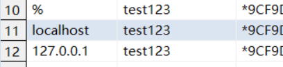

当客户端对MySQL发起连接后，服务器的鉴别方式如下：

-  MySQL服务器对mysql.user表进行排序：

   -  排序顺序： ``ORDER BY Host, User``

   -  排序原则：“明确”的值排在前面

   -  排序举例(IP)： ``'1.2.3.4'`` > ``'10.%'`` > ``'%'`` > ``''``

-  从第一行开始，逐行与传入连接的host、username进行匹配，直到匹配成功则停下。如果任何一行都无法匹配，则登录失败。

-  对比传入的口令和存储的口令是否一致，如果口令一致，那么该行即为这次登录后所使用的行（用户身份）。

.. hint:: MySQL可通过 ``skip-grant-tables`` 参数实现免密码登录。带有该参数启动时，MySQL跳过 ``mysql.user`` 及 ``mysql.db`` 等权限表的验证，从而实现 **免密码登录** ，且 **登录后具有超级权限** 。配置方式为：

   - my.ini文件中在[mysqld] (服务端)中添加 ``skip-grant-tables``
   - 在启动mysqld时添加参数 ``-–skip-grant-tables`` 

变量模型
---------------

MySQL使用系统变量控制一些运行时设置，方便管理员进行动态修改。系统变量分为Global变量和Session变量两种，其中Global变量的修改需要Super权限，而客户端可随意修改自身的Session变量。每次建立Session时，MySQL服务器会将全局变量的部分参数复制（如 ``wait_timeout`` ），并注册给Session，形成会话变量。

.. hint:: 所有涉及变量的核查，都要针对全局变量。(SHOW **GLOBAL** VARIABLES LIKE XXX)

安全机制
---------------

插件
^^^^^^^^^^^^^^^^^^^^^^^^^^^^^^

MySQL使用插件的方式，以便于官方和开发者自行添加第三方功能模块。其中发行版编译时已自带了20多个插件，在 `官方repo <https://github.com/mysql/mysql-server/tree/8.0/plugin>`_ 中可以查询内置插件。
MySQL的插件根据功能和机制的不同，分为“可动态加载”和“不可动态加载”两种。对于前者，在MySQL运行时，可直接执行SQL命令加载插件，而不需要重启数据库。加载信息写入 ``mysql.plugin`` 表中，并在重启之后自动重载。

.. code-block:: sql

   INSTALL PLUGIN myplugin SONAME 'somepluglib.so';

对于“不可动态加载”的插件而言，必须修改配置文件，或添加启动参数 ``plugin-load`` ，告知MySQL服务器需要在启动时加载的插件。

口令复杂度/validate_password
"""""""""""""""""""""""""""""""""""""""""""""

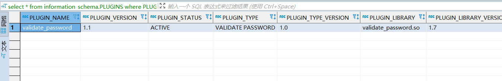

.. list-table:: validate_password 参数
   :header-rows: 1

   * - 参数
     - 说明
   * - validate_password_check_user_name
     - 设为ON时，密码中不允许包含用户名(独立开关)
   * - validate_password_policy
     - 设置密码验证级别(下方详解)
   * - validate_password_length
     - 限制密码最短长度
   * - validate_password_mixed_case_count
     - 密码中大小写字母的最少个数
   * - validate_password_number_count
     - 密码中数字的最少个数
   * - validate_password_special_char_count
     - 密码中特殊符号的最少个数
   * - validate_password_dictionary_file
     - 用于密码验证的字典文件路径

其中，密码复杂度级别/validate_password_policy说明：

-  LOW（0）：启用length。

-  MEDIUM（1）：额外启用mixed_case_count、number_count、special_char_count。

-  STRONG（2）：额外启用dictionary_file。

登录失败处理/connection_control
"""""""""""""""""""""""""""""""""""""""""""""

connection_control实现效果为，客户端多次登录失败之后，针对每个失败的登录请求，服务端延迟一定时间之后再返回认证失败的结果。如设置connection_control的参数如下：

::

   connection_control_failed_connections_threshold=3
   connection_control_min_connection_delay=1000
   connection_control_max_connection_delay=10000

客户端的前三个连续失败连接尝试没有延迟，第四次失败尝试有1000毫秒的延迟，第五次失败尝试有2000毫秒的延迟，依此类推，直到达到最大延迟 
``connection_control_max_connection_delay`` 。

+------------------------------+----------------------------------------+
|             参数             |                  说明                  |
+==============================+========================================+
| connection_control\_         | 在服务器增加后续连接尝试的延迟之前，   |
|                              |                                        |
| failed_connections_threshold | 允许客户端进行的连续失败连接尝试的次数 |
+------------------------------+----------------------------------------+
| connection_control\_         | 对于超出阈值的每个连续连接失败，       |
|                              |                                        |
| min_connection_delay         | 要递增的延迟量(ms)                     |
+------------------------------+----------------------------------------+
| connection_control\_         | 失败连接的最大延迟(ms)                 |
|                              |                                        |
| max_connection_delay         |                                        |
+------------------------------+----------------------------------------+

认证插件
"""""""""""""""""""""""""""""""""""""""""""""

MySQL的所有身份鉴别均采用插件机制，保证密码以非明文方式传输、以非明文方式存储。可在全局变量中查询默认的认证插件。

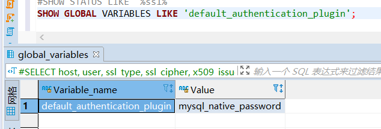

MySQL 5.7及以下版本中，创建新用户默认使用 ``mysql_native_password`` 插件(SHA1)进行认证，由客户端运行SHA1算法之后，将非明文口令发送至服务端验证。其中密码字段的运算规则为 ``concat('*', sha1(unhex(sha1(password))))``

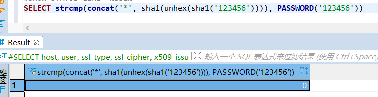

从MySQL
8.0.4开始，默认插件换成 ``caching_sha2_password`` (带高速缓存的SHA-256)。算法懒得找。

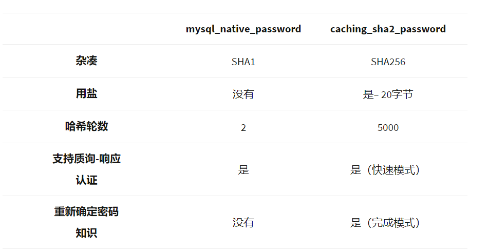

另一个常见的MySQL认证插件为 ``sha256_password`` (公私钥 with SSL)。 ``mysql_ssl_rsa_setup`` 会自动生成一对公私钥，之后MySQL使用 ``private_key.pem`` 和 ``public_key.pem`` 文件对通信过程中密码进行加密。通过查找相关变量，可以获取服务器公私钥文件的存放位置。

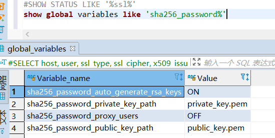

.. hint:: 

   原则上，该认证方式必须和SSL通信同时启用。对于JDBC而言，必须设置“Allow public key retrieval”。

口令过期
^^^^^^^^^^^^^^^^^^^^^^^^^^^^^^

从MySQL 5.6.6开始，User表中增加 ``password_expired`` 、 ``password_last_changed`` 、 ``password_lifetime`` ，用于控制用户的口令过期。5.7.4开始，增加全局变量 ``default_password_lifetime`` 。

- 表字段 ``password_expired / 口令已过期`` ：该字段设置为Y后，此用户还是可以登录到MySQL服务器，但是在用户未设置新口令之前，不能运行任何查询语句。

- 表字段 ``password_last_changed / 上次修改时间(时间戳)`` 、 ``password_lifetime / 口令有效期(天)`` ：用户上次修改口令距离现在超过lifetime时，将用户口令设置为expired。其中 ``password_lifetime`` 设置为Null时，该用户的口令有效期继承全局变量的值。

-  全局变量 ``default_password_lifetime / 默认口令有效期`` ： **新创建用户时** 为其设置的默认口令有效期，设置为0时不启用口令过期功能。MySQL 5.7.4 - MySQL 5.7.10中，其默认值为360。从MySQL 5.7.11开始，该参数的默认值为0。

-  全局变量 ``disconnect_on_expired_password / 在用户口令过期后是否立即结束该用户的所有会话`` ：默认值ON。

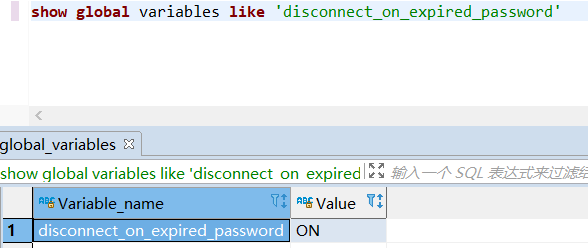

连接超时、会话超时
^^^^^^^^^^^^^^^^^^^^^^^^^^^^^^

-  连接超时变量： ``connect_timeout`` ；

-  交互式客户端空闲会话超时： ``interactive_timeout`` ；

-  非交互式客户端的空闲会话超时： ``wait_timeout`` ；

其中，交互式会话指通过MySQL Native Client连接的会话(mysql -h xxx)。非交互式会话指hibernate或jdbc等建立的会话。

操作手册
---------------

连接数据库
^^^^^^^^^^^^^^^^^^^^^^^^^^^^^^

.. code-block:: bash

   # 不加参数时默认连接本地3306数据库
   mysql -u'root' -p
   # -p后可输入密码(MySQL不推荐该方式)
   mysql -u'root' -p'my-secret-pw'
   # 客户端主动尝试SSL连接，服务器未开启SSL则连接失败
   mysql -h 192.168.3.8 -P 33306 -u'root' -p'my-secret-pw' --ssl=TRUE 

.. code-block:: sql

   SELECT current_user(); --查询当前连接匹配了user表中的哪一行
   SELECT user();--显示当前连接的实际用户名和IP地址（如'%'地址将被替换成实际地址，''用户将被替换成实际用户）

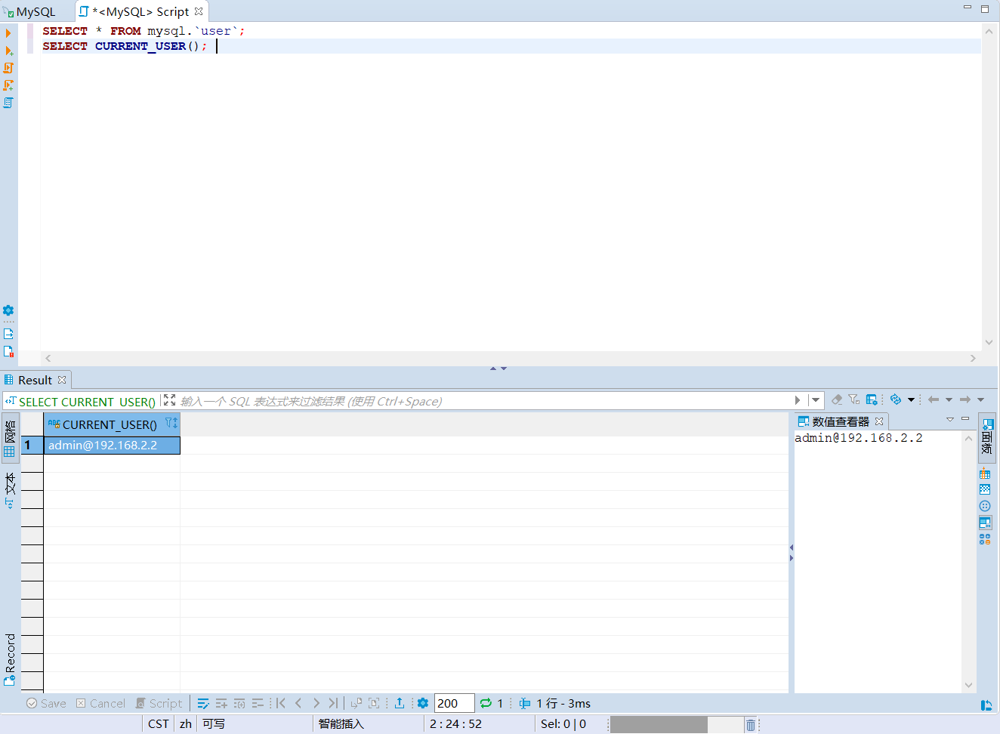

核查：空口令&口令定期更换
^^^^^^^^^^^^^^^^^^^^^^^^^^^^^^

.. code-block:: sql

   -- 在MySQL 5.7之前，User表中的口令字段为Password
   -- 从MySQL 5.7之后，口令字段改为authentication_string
   SELECT Host, `User`, authentication_string, plugin, 
          password_expired, password_last_changed, password_lifetime 
   FROM mysql.`user`; 
   -- 展示全局口令过期设置
   SHOW GLOBAL VARIABLES LIKE 'default_password_lifetime'; 
   SHOW GLOBAL VARIABLES LIKE 'disconnect_on_expired_password'; 

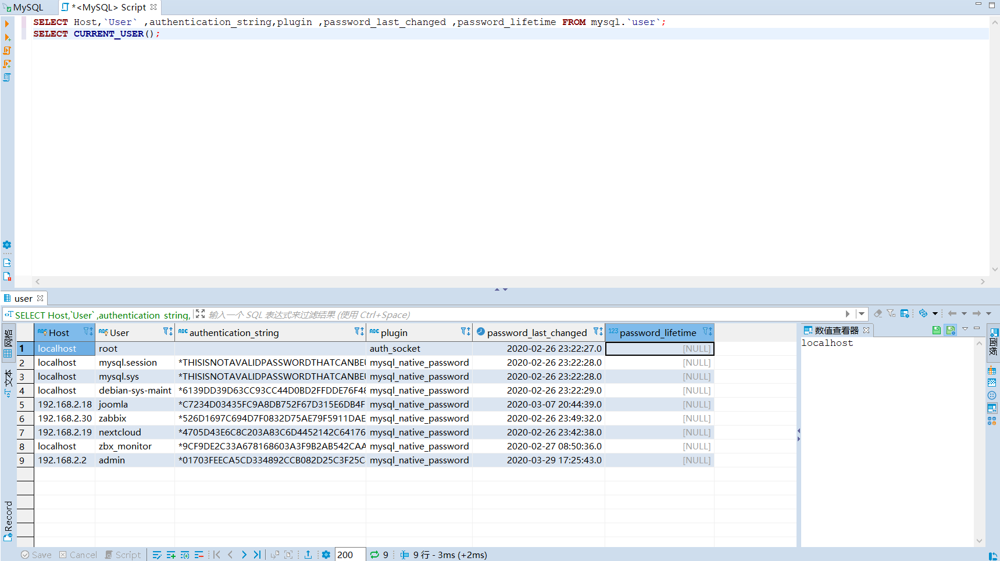

核查：已安装插件&插件参数
^^^^^^^^^^^^^^^^^^^^^^^^^^^^^^

.. code-block:: sql

   -- 列出所有插件，不能搜索
   SHOW PLUGINS; 
   -- 可以按插件名精确(=)或模糊(LIKE)搜索
   SELECT * 
   FROM information_schema.PLUGINS 
   WHERE PLUGIN_NAME = 'mysql_native_password'; 

   -- 展示插件参数变量
   SHOW GLOBAL VARIABLES LIKE 'validate_password%'; 

核查：连接超时&会话超时
^^^^^^^^^^^^^^^^^^^^^^^^^^^^^^

.. code-block:: sql

   SHOW GLOBAL VARIABLES LIKE '%timeout%';

操作：修改密码&重置密码
^^^^^^^^^^^^^^^^^^^^^^^^^^^^^^

-  操作系统中使用 ``mysqladmin``

.. code-block:: bash

   mysqladmin -u root -p'old_password' password 'new_password'

-  在MySQL内部修改

.. code-block:: sql

   UPDATE mysql.user 
   SET password=password("test") 
   WHERE user='root';
   FLUSH PRIVILEGES;

-  启用MySQL免登录模式，进入数据库后，使用方法2重置密码

.. code-block:: bash

   # 先停止MySQL的服务或守护进程
   systemctl stop mysqld # systemd
   service mysqld stop # initd

   # mysqld_safe为官方自带的守护进程
   # &表示建立子进程，并在后台运行
   mysqld_safe --skip-grant-tables &

访问控制
~~~~~~~~~~~~~~~

权限模型
---------------

MySQL采取的权限模型为DAC，其控制原则为：除非明确指定，否则默认拒绝所有访问行为。MySQL初始预置root帐户，具备数据库的所有权限，之后可以通过root帐户进行创建帐户及授权操作。授权对象管理员在进行授权操作时，可添加额外命令 ``WITH GRANT OPTION / WITH ADMIN OPTION`` ，这样用户就可以将这条权限再转授他人。

为了方便管理员进行权限管理，MySQL将权限分为四个层级，并分别存储在四张表中。在这四张权限相关表中增加数据，等同于进行赋权操作。客户端通过身份鉴别后，其权限判断过程为：

-  服务器在 ``mysql.user`` 表中检查主体和客体，确认是否存在授权值；

-  服务器在 ``mysql.db`` 表中检查主体和客体，确认是否存在授权值；

-  服务器在 ``mysql.tables_priv`` 表中检查主体和客体，确认是否存在授权值；

-  服务器在 ``mysql.columns_priv`` 表中检查主体和客体，确认是否存在授权值；

如果检查过程结束，但还是没有找到允许的权限操作，MySQL将返回无权限的错误信息。

权限列表
^^^^^^^^^^^^^^^^

-  全局权限： ``mysql.user`` 。注：某些服务器级别特权仅可在全局中设置，如 ``file_priv`` 、 ``load_priv`` 、 ``shutdown_priv`` 等。

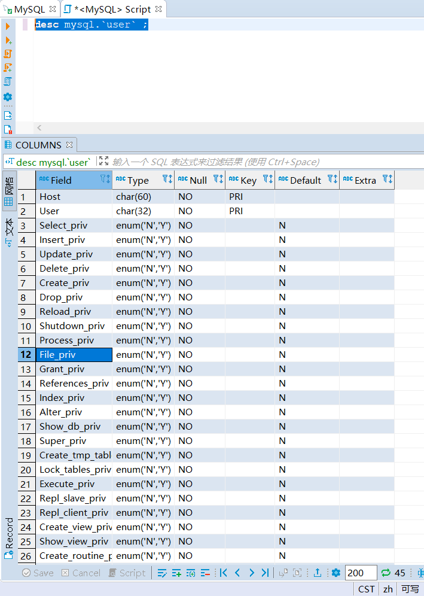

-  数据库权限： ``mysql.db`` 。有些数据库级别特权在这里设置，如execute、index、create_tmp_table等。

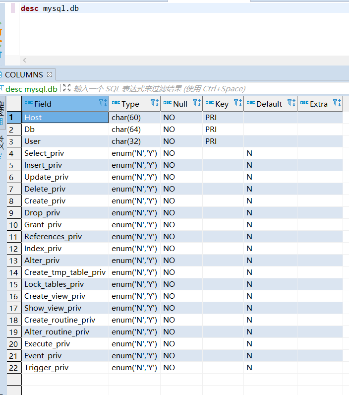

-  表权限： ``mysql.tables_priv`` 。这里基本只有增删改查权限。

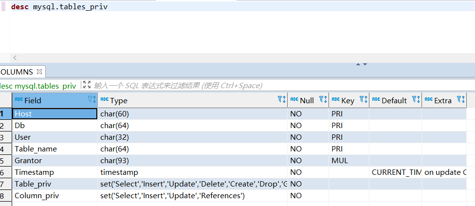

-  列权限： ``mysql.columns_priv`` 。只有增删改权限。

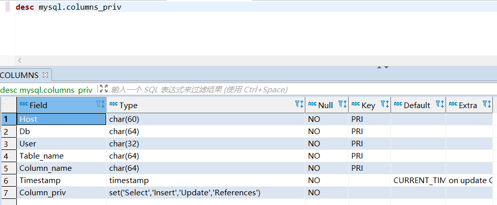

+------------------------+--------------------------------------------------------------+
|         权限名         |                             描述                             |
+========================+==============================================================+
| Reload_priv            | 用户可以执行刷新和重新加载MySQL所用各种内部缓存的特定命令，  |
|                        |                                                              |
|                        | 包括日志、权限、主机、查询和表。                             |
+------------------------+--------------------------------------------------------------+
| Shutdown_priv          | 用户可以关闭MySQL服务器。在将此权限提供给root之外的任何用户  |
|                        |                                                              |
|                        | 时，都应当非常谨慎。                                         |
+------------------------+--------------------------------------------------------------+
| File_priv              | 用户可以执行 ``SELECT INTO OUTFILE`` 和 ``LOAD DATA INFILE`` |
|                        |                                                              |
|                        | (加载服务器上的文件)命令。                                   |
+------------------------+--------------------------------------------------------------+
| Grant_priv             | 用户可以将已经授予给该用户自己的权限再授予其他用户。         |
+------------------------+--------------------------------------------------------------+
| Super_priv             | 用户可以执行某些强大的管理功能，例如通过 ``KILL`` 命令删除   |
|                        |                                                              |
|                        | 用户进程、使用 ``SET GLOBAL`` 修改全局MySQL变量、执行关于复  |
|                        |                                                              |
|                        | 制和日志的各种命令。                                         |
+------------------------+--------------------------------------------------------------+
| Create_user_priv       | 用户可以执行 ``CREATE USER`` 命令                            |
+------------------------+--------------------------------------------------------------+
| Event_priv             | 用户能否创建、修改和删除事件(5.1.6新增)                      |
+------------------------+--------------------------------------------------------------+
| Trigger_priv           | 用户能否创建和删除触发器(5.1.6新增)                          |
+------------------------+--------------------------------------------------------------+
| Process_priv           | 用户可以通过 ``SHOW PROCESSLIST`` 命令查看其他用户的进程     |
+------------------------+--------------------------------------------------------------+
| Select_priv            | 用户可以通过SELECT命令选择数据。                             |
+------------------------+--------------------------------------------------------------+
| Insert_priv            | 用户可以通过INSERT命令插入数据。                             |
+------------------------+--------------------------------------------------------------+
| Update_priv            | 用户可以通过UPDATE命令修改现有数据。                         |
+------------------------+--------------------------------------------------------------+
| Delete_priv            | 用户可以通过DELETE命令删除现有数据。                         |
+------------------------+--------------------------------------------------------------+
| Create_priv            | 用户可以创建新的数据库和表。                                 |
+------------------------+--------------------------------------------------------------+
| Drop_priv              | 用户可以删除现有数据库和表。                                 |
+------------------------+--------------------------------------------------------------+
| Index_priv             | 用户可以创建和删除表索引，可以用索引查询表。                 |
+------------------------+--------------------------------------------------------------+
| Alter_priv             | 用户可以重命名和修改表结构。                                 |
+------------------------+--------------------------------------------------------------+
| Show_db_priv           | 用户可以查看服务器上所有数据库的名字。                       |
+------------------------+--------------------------------------------------------------+
| Create_tmp_table_priv  | 用户可以创建临时表。                                         |
+------------------------+--------------------------------------------------------------+
| Lock_tables_priv       | 用户可以使用 ``LOCK TABLES`` 命令阻止对表的访问/修改。       |
+------------------------+--------------------------------------------------------------+
| Execute_priv           | 用户可以执行存储过程(5.0新增)                                |
+------------------------+--------------------------------------------------------------+
| Repl_slave_priv        | 用户可以读取用于维护复制数据库环境的二进制日志文件。         |
+------------------------+--------------------------------------------------------------+
| Repl_client_priv       | 用户可以确定复制从服务器和主服务器的位置。                   |
+------------------------+--------------------------------------------------------------+
| Create_view_priv       | 用户可以创建视图(5.0新增)                                    |
+------------------------+--------------------------------------------------------------+
| Show_view_priv         | 用户可以查看视图或了解视图如何执行(5.0新增)                  |
+------------------------+--------------------------------------------------------------+
| Create_routine_priv    | 用户可以更改或放弃存储过程和函数(5.0新增)                    |
+------------------------+--------------------------------------------------------------+
| Alter_routine_priv     | 用户可以修改或删除存储函数及函数(5.0新增)                    |
+------------------------+--------------------------------------------------------------+
| Create_tablespace_priv | 创建表空间                                                   |
+------------------------+--------------------------------------------------------------+

默认帐户
^^^^^^^^^^^^^^^^

-  MySQL5.7之前，特权帐户仅有root帐户，且不可删除、不可重命名。

-  MySQL 5.7.7及以上新增sys schema，将root帐户与系统表、系统视图的从属关系进行分离，故可实现root帐户的重命名。sys schema的属主为新增帐户 ``mysql.sys`` ， ``mysql.session`` 帐户用于会话管理。

-  MySQL 8.0及以上进一步新增系统帐户 ``mysql.infoschema`` 。以上系统帐户均为锁定状态，且不得修改属性，否则将导致数据库无法正常运行。

操作手册
---------------

核查：用户权限
^^^^^^^^^^^^^^^^^^^^^^^^^^^^^^

.. code-block:: sql

   -- 需关注user表、db表中的grant_priv字段，判断帐户是否能够将自己的权限再次分配
   SHOW GRANTS FOR root@'%'; --展示该用户创建时的授权语句

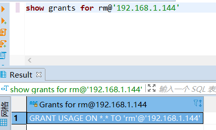

.. code-block:: sql

   SELECT * FROM mysql.`user`; --展示用户的实际权限
   SELECT * FROM mysql.db;
   SELECT * FROM mysql.tables_priv;
   SELECT * FROM mysql.columns_priv;

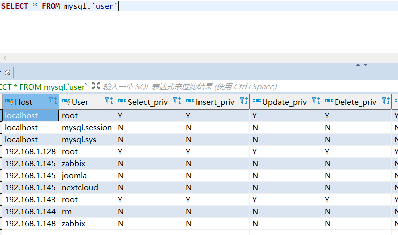

.. code-block:: sql

   -- 除了管理员帐户，其他帐户不应具有全局访问权限
   SELECT user, host 
   FROM mysql.user 
   WHERE (Select_priv = 'Y') OR (Insert_priv = 'Y') OR (Update_priv = 'Y') OR 
         (Delete_priv = 'Y') OR (Create_priv = 'Y') OR (Drop_priv = 'Y'); 

   -- 除了管理员帐户，其他帐户不应具备权限表的管理权限
   SELECT user, host 
   FROM mysql.db 
   WHERE db = 'mysql' AND ((Select_priv = 'Y') OR (Insert_priv = 'Y') OR (Update_priv = 'Y') OR 
         (Delete_priv = 'Y') OR (Create_priv = 'Y') OR (Drop_priv = 'Y')); 

   --除了管理员帐户，其他帐户不应具备系统操作权限
   SELECT user, host 
   FROM mysql.user 
   WHERE (file_priv = 'Y') OR (process_priv = 'Y') OR (super_priv = 'Y') OR 
         (shutdown_priv = 'Y') OR (create_user_priv = 'Y') OR (grant_priv = 'Y') OR
         (reload_priv = 'Y') OR (repl_slave_priv = 'Y'); 

   -- 管理员帐户不应具有业务数据库的INSERT，SELECT，UPDATE，DELETE，DROP，CREATE和ALTER权限。
   SELECT User, Host, db 
   FROM mysql.db 
   WHERE Select_priv='Y' OR Insert_priv='Y' OR Update_priv='Y' OR Delete_priv='Y' OR
         Create_priv='Y' OR Drop_priv='Y' OR Alter_priv='Y';

权限分配
^^^^^^^^^^^^^^^^^^^^^^^^^^^^^^

.. code:: sql

   -- 创建帐户并赋权
   -- 实际上只需要在user表中限制远程连接地址，非法地址在登录时就被拒绝连接
   CREATE USER 'user1'@'x.x.x.x' IDENTIFIED BY 'xxxx';
   GRANT ALL PRIVILEGES ON somedb.* to 'user1'@'%';

   -- 某个MySQL监控器所需要的全局权限
   CREATE USER 'user1'@'x.x.x.x' IDENTIFIED BY 'xxxx' WITH MAX_USER_CONNECTIONS 3;
   GRANT PROCESS, REPLICATION CLIENT, SELECT ON *.* TO 'user1'@'x.x.x.x';

   -- 一般DB管理员需要分配DB级的所有权限
   -- MySQL 5.7及以下的版本，默认未启用NO_AUTO_CREATE_USER(SQL_Mode)
   -- 因此create user和grant可以同时进行。如果grant了一个不存在的用户，MySQL自动创建
   -- 可通过以下语句查询当前SQL_Mode
   -- SELECT @@global.sql_mode
   -- MySQL 8.0之后默认启用NO_AUTO_CREATE_USER，必须先create再grant
   GRANT ALL PRIVILEGES ON somedb.* to 'user2'@'%' IDENTIFIED BY 'xxxx';
   UPDATE mysql.user SET host='%' where user='user3';

   -- 如果为用户赋予GRANT权限，则该用户能将自己的权限进行转授
   GRANT ALL PRIVILEGES ON somedb.* to 'user3'@'%' WITH GRANT OPTION;
   -- GRANT和ADMIN的区别：
   -- WITH GRANT OPTION的用户，如果授权用户的某个权限给撤回了，那么他所授予给其他用户的这个权限也会一并没了；
   -- WITH ADMIN OPTION不会追溯转授行为，转授的权限不会收回。
   GRANT ALL PRIVILEGES ON somedb.* to 'user3'@'%' WITH ADMIN OPTION;

   -- 由于需要频繁读取，MySQL在启动时，会将四张权限表装载入内存。
   -- 因此修改权限或手动创建用户后，需要使用flush命令重新装载
   FLUSH PRIVILEGES;

配置三权分立-安全管理员
^^^^^^^^^^^^^^^^^^^^^^^^^^^^^^

.. code:: sql

   -- 赋予重载权限表的权限
   UPDATE mysql.user SET Reload_priv = 'Y' WHERE user = 'test';
   -- 仅授予该用户对mysql.user中权限部分的SELECT及UPDATE权限（不允许删除用户）
   GRANT SELECT(host, user, Select_priv, Insert_priv, Update_priv, Delete_priv, Create_priv, Drop_priv), 
         UPDATE(Select_priv, Insert_priv, Update_priv, Delete_priv, Create_priv, Drop_priv) 
   ON mysql.user 
   TO 'test'@'%';

   -- 授予该用户对其他三张权限表的维护权限
   GRANT SELECT, UPDATE, DELETE, INSERT ON mysql.db TO 'test'@'%';
   GRANT SELECT, UPDATE, DELETE, INSERT ON mysql.tables_priv ON 'test'@'%';
   GRANT SELECT, UPDATE, DELETE, INSERT ON mysql.columns_priv ON 'test'@'%';
   FLUSH PRIVILEGES;
   -- 之后安全管理员通过编辑四张表的形式进行授权，而不是通过GRANT的方式

安全审计
~~~~~~~~~~~~~~~

general log
------------------------------

在MySQL中自带了 **全局日志** 功能—— general log ，作用是记录MySQL服务器每时每刻发生的事件（如SQL命令执行、服务器状态、服务器错误）。 general log 一旦开启，会给服务器和数据库带来一定资源占用。

general log具有一定缺陷：

-  只记录命令内容，不记录命令的操作结果；

-  可读性一般：

   -  每个客户端采用ID进行标识(ID为自增主键)，如果要追溯操作的主体，只能靠搜索该ID的Connect操作实现；

   -  无法快速根据操作客体查找；

其字段如下：

======== ====================
字段     内容
======== ====================
Time     时间戳
Id       客户端连接ID
Command  Query/Connect/Quit等
Argument 具体内容
======== ====================

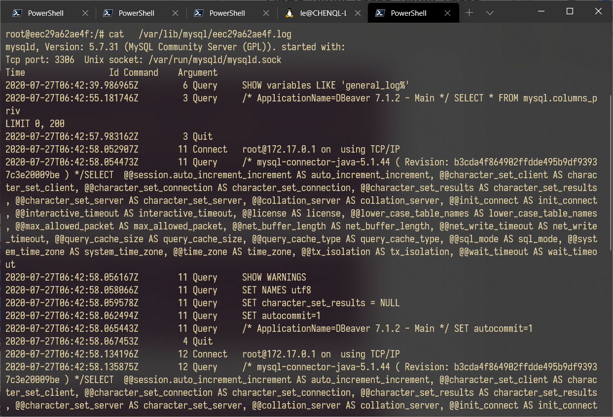

MySQL数据库中有几个全局变量与 general log 的设置有关：

-  ``general_log`` ：开关；

-  ``log_output`` ：日志存放位置 (MySQL 5.1.6 后引入)；

   -  FILE(Default)：操作系统文件；

   -  TABLE：mysql.general_log表；

-  ``general_log_file`` ：日志文件位置；

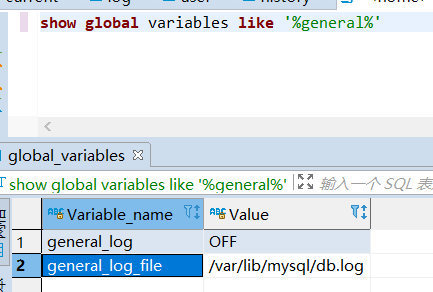

MariaDB Server Audit Plugin
------------------------------

该插件本来是为了MariaDB开发，但可以直接用于部分MySQL，占用稍微小一点。将 ``server_audit.so`` 复制过来之后手动安装就行。该插件的有效变量如下：

.. list-table:: MariaDB Server Audit Plugin 参数
    :header-rows: 1

    * - 参数
      - 说明
    * - serve_audit_logging
      - 启动或关闭
    * - server_audit_output_type
      - 指定日志输出类型，可为SYSLOG或FILE
    * - server_audit_syslog_facility
      - SYSLOG模式下，指定facility(输出到哪个syslog组件)，默认为LOG_USER(记录在user.log中)
    * - server_audit_syslog_ident
      - SYSLOG模式下，指定ident(日志行中的主体字段) 默认为mysql-server_auditing
    * - server_audit_syslog_info
      - SYSLOG模式下，在每行日志中添加指定字符串
    * - server_audit_syslog_priority
      - SYSLOG模式下，定义日志消息级别(DEBUG/INFO等)
    * - server_audit_file_path
      - FILE模式下，使用该变量设置存储日志的文件。若设置为目录，则存放在目录下的server_audit.log文件中
    * - server_audit_file_rotate_size
      - FILE模式下，限制日志文件的大小，默认1MB后rotate
    * - server_audit_file_rotations
      - FILE模式下，指定日志文件的数量，默认保留9个。若设置为0则不进行rotate
    * - server_audit_file_rotate_now
      - FILE模式下，设置该变量为1时，强制进行一次rotate(一次性变量)
    * - server_audit_events
      - 指定记录事件的类型(下方详解)
    * - server_audit_incl_users
      - 审计的用户列表(如果开启了Connect审计，则所有用户的Connect始终记录，无视该参数)
    * - server_audit_excl_users
      - 不审计的用户列表(如果开启了Connect审计，则所有用户的Connect始终记录，无视该参数)

server_audit_events指明记录的事件，如果为空字符串，则代表记录所有的事件。具体参数如下：

-  ``CONNECT`` 连接、断开连接和失败的连接，包括错误代码

-  ``QUERY`` 以纯文本形式执行的查询及其结果，包括由于语法或权限错误而失败的查询

-  ``TABLE`` 受查询执行影响的表

-  ``QUERY_DDL`` (Plugin Version >= 1.2.0)
   与QUERY类似，但只筛选DDL类型的查询（create、alter、drop、rename和truncate语句，create/drop[procedure/function/user]
   和rename user除外（它们不是DDL）

-  ``QUERY_DML``  (Plugin Version >= 1.2.0)
   与QUERY类似，但只筛选DML类型的查询（do、call、load
   data/xml、delete、insert、select、update、handler和replace语句）

-  ``QUERY_DCL``  (Plugin Version >=
   1.3.0) 与QUERY类似，但只筛选DCL类型的查询（create user、drop
   user、rename user、grant、revoke和set password语句）

-  ``QUERY_DML_NO_SELECT``  (Plugin Version >=
   1.4.4) 与QUERYDML类似，但不记录SELECT查询。（do、call、load
   data/xml、delete、insert、update、handler和replace语句）

MySQL Enterprise Audit Plugin (仅企业版本)
---------------------------------------------

MySQL 企业版的 Enterprise Edition 中自带 Audit Plugin，so文件为 ``audit_log.so`` 。该插件的相关系统变量为：

+----------------------------+------------------------------------------------------+
|            参数            |                         说明                         |
+============================+======================================================+
| auditlog_connection_policy | 记录连接日志的种类(ALL/ERROR/NONE)                   |
+----------------------------+------------------------------------------------------+
| auditlog_file              | 日志记录的文件名，可以是相对路径或绝对路径           |
+----------------------------+------------------------------------------------------+
| auditlog_format            | 日志格式，可以是 OLD（旧样式XML），                  |
|                            |                                                      |
|                            | NEW（新样式XML，默认值）和（从MySQL 5.7.21开始）JSON |
+----------------------------+------------------------------------------------------+
| auditlog_include_accounts  | 审计的用户列表(不能与exclude同时设置)                |
+----------------------------+------------------------------------------------------+
| auditlog_exclude_accounts  | 不审计的用户列表(不能与include同时设置)              |
+----------------------------+------------------------------------------------------+
| auditlog_policy            | 记录的事件类型(ALL/LOGINS/QUERIES/NONE)              |
+----------------------------+------------------------------------------------------+
| auditlog_st atementpolicy  | 记录的语句事件类型(ALL/ERRORS/NONE)                  |
|                            |                                                      |
|                            | 注：优先级低于auditlogpolicy，设置冲突时会被覆盖     |
+----------------------------+------------------------------------------------------+
| auditlog_rotateonsize      | 限制日志文件的大小，若设置为0则不进行rotate          |
|                            |                                                      |
|                            | 注：必须为4096的倍数，否则将下取整到最近的倍数       |
+----------------------------+------------------------------------------------------+

日志内容如下：

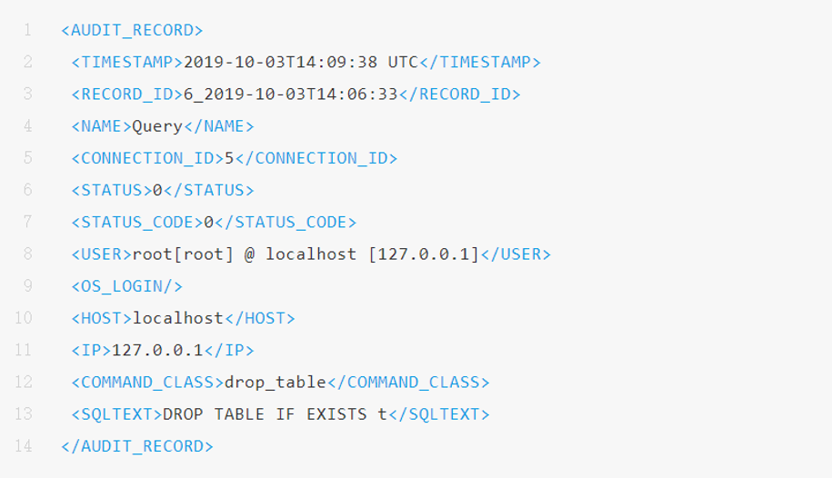

McAfee Audit Plugin
------------------------------

McAfee已不再更新，最新版本v1.1.6(2018-03)，不建议使用

支持的MySQL/MariaDB/Percona列表可在官方\ `Changelog <https://github.com/mcafee/mysql-audit/wiki/Changelog>`__\ 上查询

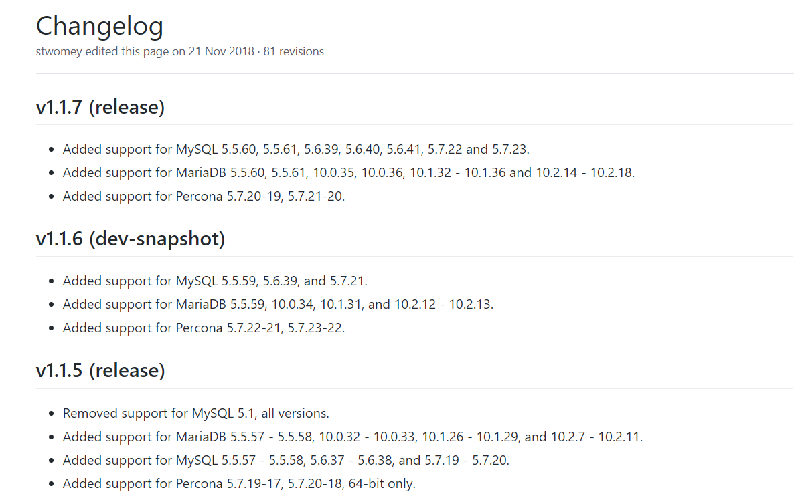

该插件的主要变量如下，其余变量可在\ `官方文档 <https://github.com/mcafee/mysql-audit/wiki/Configuration>`__\ 查询：

.. list-table:: McAfee Audit Plugin 参数
   :header-rows: 1

   *  - 参数
      - 说明
   *  - audit_json_file
      - 开关（ON\OFF）
   *  - audit_json_log_file
      - 日志存储位置，默认为MySQL的data目录
   *  - audit_record_cmds
      - 需要监控的SQL命令，默认全部（即该值为null） 如：'insert,delete,update,create,drop,alter,grant,truncate'
   *  - audit_record_objs
      - 需要监控的数据库名称和表名，默认全部（即该值为null） 如：'mysql.*'

日志文件的格式是json：

.. code:: json

   {
       "msg-type": "activity",
       "date": "1510038432019",
       "thread-id": "43",
       "query-id": "1891",
       "user": "root",
       "priv_user": "root",
       "ip": "",
       "host": "localhost",
       "connect_attrs": {
           "_os": "linux-glibc2.5",
           "_client_name": "libmysql",
           "_pid": "4009",
           "_client_version": "5.7.9",
           "_platform": "x86_64",
           "program_name": "mysql"
       },
       "pid": "4009",
       "os_user": "root",
       "appname": "mysql",
       "rows": "1",
       "cmd": "insert",
       "objects": [{
           "db": "part",
           "name": "e",
           "obj_type": "TABLE"
       }],
       "query": "insert into e values (9898,'smart','james')"
   }

操作手册
---------------

核查：审计开关
^^^^^^^^^^^^^^^^^^^^^^^^^^^^^^

.. code:: sql

   -- 查看general log
   SHOW GLOBAL VARIABLES LIKE '%general%';
   SHOW GLOBAL VARIABLES LIKE '%log_output%';

   -- 查看MariaDB Server Audit Plugin
   SHOW GLOBAL VARIABLES LIKE 'server_audit%';

   -- 查看MySQL Enterprise Audit Plugin
   SHOW GLOBAL VARIABLES LIKE 'auditlog%';

   -- 查看McAfee Audit Plugin
   SHOW GLOBAL VARIABLES LIKE 'audit_%';

入侵防范
~~~~~~~~~~~~~~~

操作手册
---------------

核查：多余功能
^^^^^^^^^^^^^^^^^^^^^^^^^^^^^^

.. code:: sql

   -- 关闭allow-suspicious-udfs (防止通过共享对象文件加载存在威胁的UDFs函数)
   -- 默认不启用
   SHOW GLOBAL VARIABLES LIKE 'allow-suspicious-udfs';

   -- 关闭local_infile(防止从本地读取文件)
   -- 默认启用
   SHOW GLOBAL VARIABLES LIKE 'local_infile';

   -- 开启skip-symbolic-links(禁止数据库用户删除或重名数据文件目录之外的文件)
   -- 默认不启用
   SHOW GLOBAL VARIABLES LIKE 'have_symlink'; --应为DISABLE

   -- 禁用daemon_memcached插件(防止memcached造成内存泄漏)
   -- 默认不安装
   SELECT * FROM information_schema.plugins WHERE PLUGIN_NAME='daemon_memcached';

   -- 设置secure_file_priv(限制客户端可以通过load_file读取数据文件的路径)
   -- 默认为'/var/lib/mysql-files/'
   SHOW GLOBAL VARIABLES WHERE Variable_name = 'secure_file_priv';

一个好用的备份脚本
^^^^^^^^^^^^^^^^^^^^^^^^^^^^^^

可实现"-k"指定保留日期、"-d"指定备份的数据库。

.. code-block:: bash
   :linenos:

   #!/bin/bash
   USER=root
   PASS=pass
   BAKFILENAME='all'
   DATE=$(date +%Y%m%d)
   BAKPATH=/path/to/mysqlbak
   KEEP=7

   #########################
   while [[ $# > 0 ]]; do
       case "$1" in
           -k|--keep)
               KEEP=$(($2-1))
               shift 
               ;;
           -d|--database)
               DB="$2"
               BAKFILENAME="$2"
               shift
               ;;
           *)
               ;;
       esac
       shift 
   done
   ###############################

   # 本地安装环境的备份
   mysqldump -u'$USER' -p'$PASS' '$DB' > '$BAKPATH/$BAKFILENAME'_'$DATE'.sql
   # docker环境的备份
   docker exec --user root mysql5 sh -c "mysqldump -u'$USER' -p'$PASS' '$DB'" > '$BAKPATH/$BAKFILENAME'_'$DATE'.sql
   # 定期清除旧文件
   find $BAKPATH -mtime +$KEEP -name $BAKFILENAME'_*.sql' -exec rm -rf {} \;

安全通信
~~~~~~~~~~~~~~~

SSL模型
---------------

MySQL支持SSL通信加密及SSL双向认证(X509)的安全机制。在查阅资料时(20-09-17)，MySQL仅对5.6、5.7、8.0三个版本提供支持，官方文档也只包括这三个版本，这三个版本全系列均支持SSL功能。老版本中，MySQL 5.5查得到SSL配置文档，但更老的版本缺失资料。

在5.6.46前及5.7.28前的MySQL版本中，MySQL同时支持使用yaSSL库或OpenSSL库进行编译。MySQL 8.0全系列及较新的5.6、5.7版本仅支持使用OpenSSL库编译。yaSSL支持的特性较少，如不支持X509双向认证、最高支持TLSv1.0版本的协议等。在数据库中可通过查询ssl相关的全局变量，获取MySQL编译时是否引入了SSL库(have_ssl)，是否使用 OpenSSL库编译(have_openssl)。如果这两个参数为DISABLED，则说明该数据库支持SSL，但未启用。

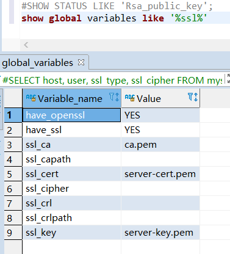

操作手册
---------------

配置SSL
^^^^^^^^^^^^^^^^^^^^^^^^^^^^^^

1. 生成证书：

- MySQL 5.6 及以下，用户只能通过OpenSSL手动生成证书及密钥。

- MySQL 5.7以上，安装后在 ``/usr/bin/`` 下释放一个二进制文件 ``mysql_ssl_rsa_setup`` 。当MySQL的data目录下不存在 ``ca.pem`` 、 ``server-cert.pem`` 、 ``server-key.pem`` 时，运行该程序后会自动调用OpenSSL，在data目录下生成相关证书和密钥。 

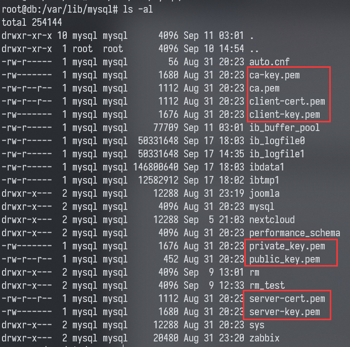

2. 将证书复制到data文件夹内（记得设置权限<600)。之后在配置中，加入 ``ssl_ca`` 、 ``ssl_cert`` 、 ``ssl_key`` 参数，导入相关证书和密钥，并重启服务器后，即可开启SSL。

配置X509
^^^^^^^^^^^^^^^^^^^^^^^^^^^^^^

（没试过，抄的）

把 ``mysql_ssl_rsa_setup`` 生成的 ``ca.pem`` (私有CA证书)、 ``client-cert.pem`` (客户端证书)、 ``client-key.pem`` (客户端密钥)复制到客户端，之后通过以下命令连接：

.. code-block:: bash

   mysql -u'user' \
         -p'pass' \
         -h mysql_server_IP \
         --ssl-ca=/path/to/ca.pem \
         --ssl-cert=/path/to/client-cert.pem \
         --ssl-key=/path/to/client-key.pem

或将以上参数添加到 ``~/.my.cnf`` 文件中：

.. code-block:: kconfig

   [client]
   ssl-ca = /path/to/ca.pem
   ssl-cert = /path/to/client-cert.pem
   ssl-key = /path/to/client-key.pem

配置强制SSL
^^^^^^^^^^^^^^^^^^^^^^^^^^^^^^

.. code:: sql

   -- 核查是否支持SSL，是否配置了证书、CA证书和Key
   SHOW GLOBAL VARIABLES LIKE '%ssl%';

   -- 以下情况二选一配置，任意一条有效均可
   -- 配置全局变量，限制所有用户仅允许使用SSL连接
   SHOW GLOBAL VARIABLES LIKE 'require_secure_transport';
   -- 为所有远程连接用户单独配置，限制仅允许使用SSL连接
   -- 关注ssl_type参数，为ANY或X509均可，不得为Null
   SELECT host, user, ssl_type, ssl_cipher, x509_issuer, x509_subject 
   FROM mysql.`user`;

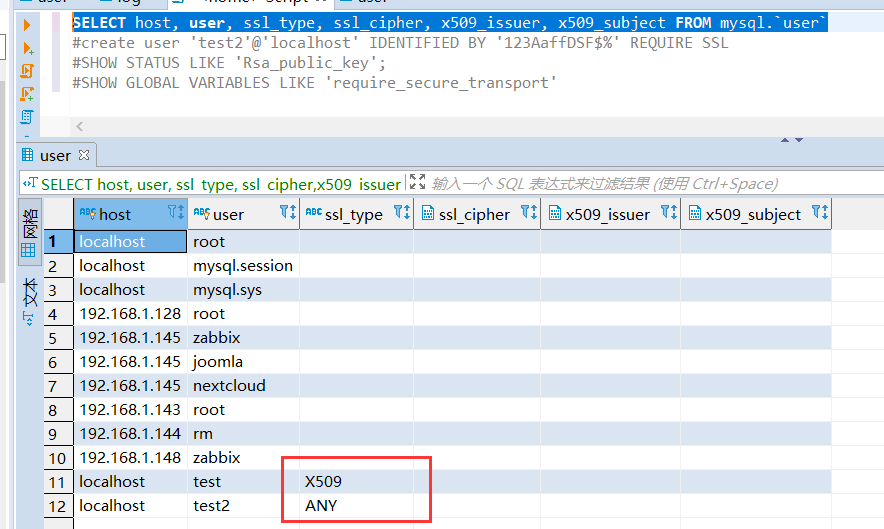

查看当前连接是否为SSL
^^^^^^^^^^^^^^^^^^^^^^^^^^^^^^

.. code:: sql

   -- 在JDBC查询中用show status like命令
   -- 如果是SSL连接，ssl_cipher和ssl_version均不为空
   SHOW STATUS LIKE '%ssl%';
   -- 在MySQL Native Client中可直接使用status命令(或\s)
   status;

.. image:: media/mysql/d7e61ccf373cf8cfd86e8fb46db876e0.png
   :align: center