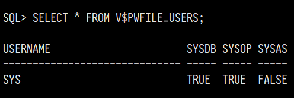
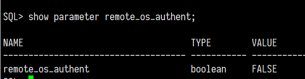
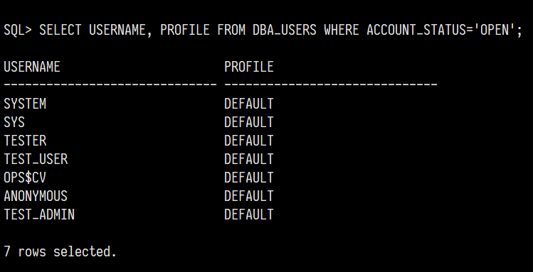
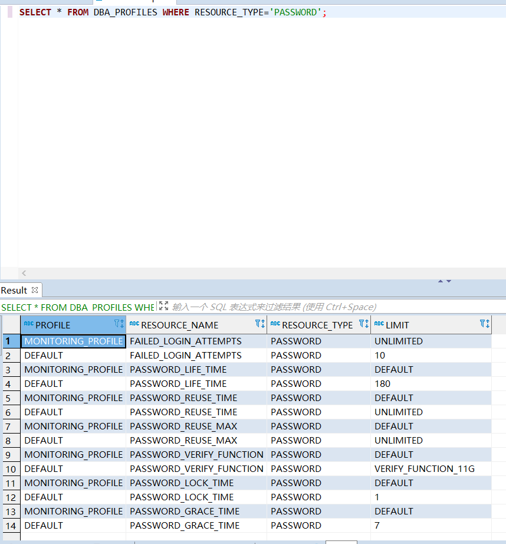
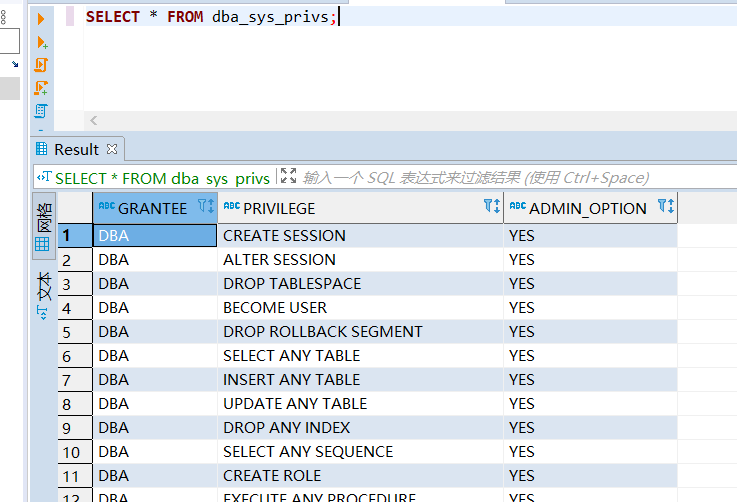
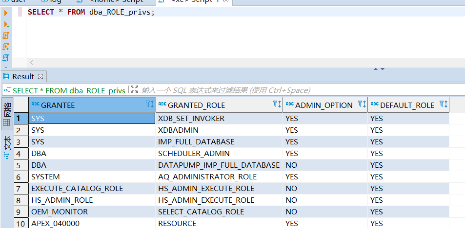
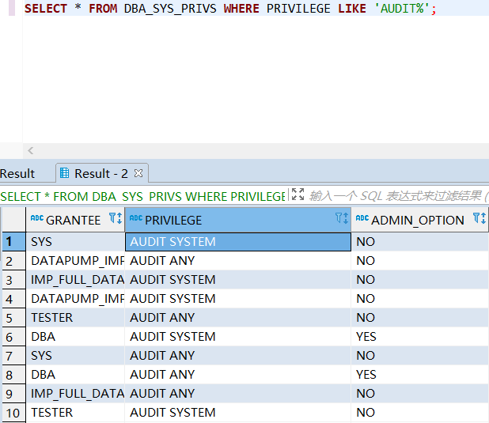
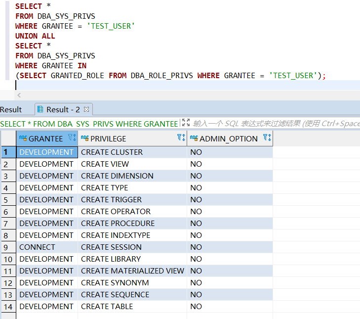
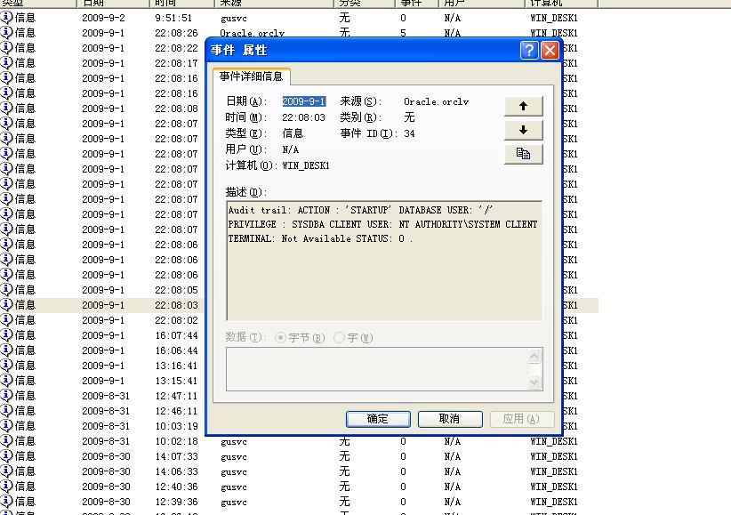
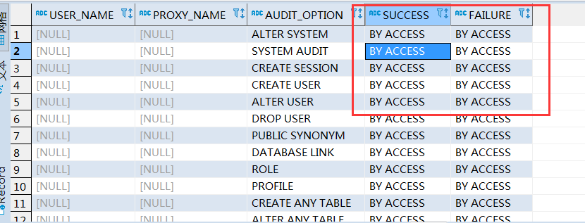

Oracle
======

- 发行商

   - Oracle

- 是否免费

   - Oracle Database Express Edition：免费&受限

      - Up to 12 GB of user data
      - Up to 2 GB of database RAM
      - Up to 2 CPU threads
      - Up to 3 Pluggable Databases

   - Oracle Database：收费

   - Oracle Cloud Free Tier：永久免费计划

      - 2 databases total, each with 1 OCPU and 20 GB storage.
      - 2 virtual machines with 1/8 OCPU and 1 GB memory each.
      - 2 Block Volumes, 100 GB total. 10 GB Object Storage. 10 GB Archive Storage.
   
   - Oracle Cloud：收费（常规云服务）

- Latest Patch查询

   - `季度安全补丁发布说明 <https://www.oracle.com/security-alerts/>`_

.. note::
   Oracle数据库的安全补丁属于增值服务，部分补丁需要购买。

----

.. contents::

----

身份鉴别
--------

体系架构
~~~~~~~~

Oracle的实例和数据库代表不同的概念。实例代表Oracle的即时状态，数据库代表Oracle的文件集合。一个实例在其生存期内只能装载（ALTER DATABASE MOUNT）和打开（ALTER DATABASE OPEN）一个数据库，但一个数据库可被许多实例同时装载和打开（即RAC模式）。两者涵盖的内容主要如下：

-  Oracle实例 = 进程 + 进程所使用的内存(SGA)

-  数据库 = 重做文件 + 控制文件 + 数据文件 + 临时文件

显然地，一个Oracle实例只能运行在单台计算节点上，且只能监听来自本地共享内存的请求。因此Oracle提供了名为SQLNet的外壳程序，在操作系统层面注册了TNS服务，由TNS服务监听来自IPC、TCP/IP的请求，并根据配置中注册的实例信息，将请求转发到对应数据库实例的共享内存中。转发时通过SID或服务名对实例进行标识。

外壳认证
~~~~~~~~

SQLNet组件以外壳方式提供一些额外身份鉴别机制，对应参数为 ``$ORACLE_HOME/network/admin/sqlnet.ora`` 文件中的 ``SQLNET.AUTHENTICATION_SERVICES`` ，其参数包括：

-  beq：Linux或Unix操作系统级别身份认证

-  nts：Windows操作系统级别身份认证

-  kerberos5/radius

-  tcps：基于SSL层的公私钥认证

特别地，beq（Bequeath Protocol）是Oracle在类Unix操作系统中提供的特殊通信协议。该协议可用于客户端与数据库之间的本地通信，且\ **不需要通过Listener**\ 。因此，在数据库实例未启动时，可以直接经由beq协议连接数据库，能起到应急连接的作用。

.. hint::

   如果该参数没有配置，Windows操作系统的默认值为none，Linux操作系统的默认值为beq。

若启用了基于操作系统的认证方式，如果用户在操作系统中的管理员用户组，该用户可直接通过 ``sqlplus / as sysdba`` 登录。管理员用户组默认值如下：

-  dba用户组(Linux)

-  ora_dba组(Windows)

实例认证
~~~~~~~~

.. hint::
   以下三种认证均为独立配置。此外，上节所述的外壳认证与实例认证也互相独立。

基本方式(local)
^^^^^^^^^^^^^^^

实例可通过数据库中DB帐户的信息（存放于 ``DBA_USERS`` ）对登录用户进行身份鉴别。在鉴别时，需输入DB帐户的用户名+口令。采用基本方式鉴别时，所有帐户仅能以普通权限连接数据库（as normal）。若要以sysdba等特权身份连接，则必须配置密码文件，详见下节。除了JDBC外，可通过Oracle自带的sqlplus连接实例。

.. code:: bash

   # name和pass不可省略
   # 要是省略了还登录成功，说明用了其他方式
   sqlplus name/pass @host:port/sid

密码文件方式(remote)
^^^^^^^^^^^^^^^^^^^^

.. note::
   remote概念与local相对，表示采用\ **数据库文件中存储的帐户信息**\ 以外的方式进行认证。

Oracle实例支持将部分帐户的密码存放在操作系统中（加密方式），制作成密码文件，并可在密码文件中定义该帐户是否可以特权方式连接实例（as sysdba / as sysoper）。Oracle初始安装后，默认为SYS帐户生成密码文件，且SYS帐户同时拥有sysdba和sysoper的特权。之后可以使用 ``orapwd`` 工具配置密码文件的相关参数。密码文件的存放位置如下：

-  (Linux) ``$ORACLE_HOME/dbs/orapw\*``

-  (Windows) ``$ORACLE_HOME\database\PWDsid.ora``

可在Oracle中查看密码文件认证的变量参数 ``REMOTE_LOGIN_PASSWORDFILE`` 。其有效参数值如下：

-  ``NONE`` 忽视任何密码文件，关闭密码文件认证开关。

-  ``EXCLUSIVE`` 启用密码文件认证开关，设置为独占模式（密码文件仅可被单个实例使用）。该模式下，可以将SYSDBA权限给非SYS用户。

-  ``SHARED`` 启用密码文件认证开关，设置为共享模式（密码文件可以被一台服务器上的多个实例或者RAC集群实例共享）。该模式下，无法将SYSDBA权限给非SYS用户，且密码文件无法编辑。

可以在Oracle中查看 ``V$PWFILE_USERS`` 视图，查看密码文件中设置了哪些数据库帐户。这些帐户可以以特权方式连接 Oracle 实例。

|image1|

操作系统方式(remote)
^^^^^^^^^^^^^^^^^^^^

可在Oracle中查看操作系统认证的变量参数 ``REMOTE_OS_AUTHENT``。

|image2|

此外，Oracle中存在相关参数 ``OS_AUTHENT_PREFIX`` ，默认值为 ``ops$`` ，只有以prefix为前缀的数据库帐户才能使用操作系统认证的方式。启用了操作系统认证之后，在数据库中只要存在prefix+username的帐户，用户在使用username帐户成功登录客户端操作系统之后，就可以直接通过sqlplus等工具免密码登录数据库。

.. attention::
   Oracle官方文档也不建议启用这种认证方式。测评时看到该认证方式启用的话，身份鉴别(a)应判不符合。

Profile
~~~~~~~

Oracle系统中的profile可以用来对用户所能使用的数据库资源进行限制。使用 ``CREATE PROFILE profileA`` 命令创建一个profile，并把该profile分配给帐户，则帐户所能使用的数据库资源都在该profile的限制之内。

|image3|

.. hint::

   创建profile必须要有CREATE PROFILE的系统权限。

口令复杂度、定期更换
^^^^^^^^^^^^^^^^^^^^

|image4|

在profile中可以查找到相关的参数，用于控制帐户的口令使用周期、口令复杂度等。

.. attention::
   SYS帐户不受口令复杂度参数的限制。

+--------------------------+------------------------------------------+
| 参数                     | 说明                                     |
+==========================+==========================================+
| PASSWORD_LIFE_TIME       | 口令最长使用时间                         |
+--------------------------+------------------------------------------+
| PASSWORD_GRACE_TIME      | 口令有效期                               |
|                          | 到期后的宽恕时间（宽恕时间内，连接数据库 |
|                          | 将产生一个告警。超过宽恕时间则拒绝连接） |
+--------------------------+------------------------------------------+
| PASSWORD_REUSE_MAX       | 口令历史记录保留次数                     |
+--------------------------+------------------------------------------+
| PASSWORD_REUSE_TIME      | 口令历史记录保留时间                     |
+--------------------------+------------------------------------------+
| PASSWORD_VERIFY_FUNCTION | 口令复杂度校验函数                       |
+--------------------------+------------------------------------------+

.. hint::

   Oracle 11g对口令复杂度校验函数进行略微修改，命名为verify_function_11G。要求口令长度不低于9位，需要同时包含数字、字母，比verify_function弱点。如果数据库未安装该函数的话，执行 ``$ORACLE_HOME/rdbms/admin/utlpwdmg.sql`` 即可。

登录失败、连接超时
^^^^^^^^^^^^^^^^^^
+-----------------------+---------------------------------------------+
| 参数                  | 说明                                        |
+=======================+=============================================+
| FAILED_LOGIN_ATTEMPTS | 最大错误登录次数                            |
+-----------------------+---------------------------------------------+
| PASSWORD_LOCK_TIME    | 锁定帐户时间（天）                          |
+-----------------------+---------------------------------------------+
| CONNECT_TIME          | 会话的总最大时间，超过该时间则              |
|                       | 回滚当前事务，结束会话，并返回错误（分钟）  |
+-----------------------+---------------------------------------------+
| IDLE_TIME             | 会话的最大连续空闲时间（分钟）              |
+-----------------------+---------------------------------------------+

.. hint::

   IDLE_TIME和CONNECT_TIME属于资源限制类参数，通过全局参数resource_limit统一控制开关。该参数设置为true的话，超时设置就会生效，false的话超时配置就不会生效。

SQLNet配置示例
~~~~~~~~~~~~~~

SQLNet的配置文件默认位于 ``$ORACLE_HOME/network/admin`` 中，由三个文件组成：

-  sqlnet.ora：记录SQLNet的配置、连接参数、登录地址限制等

.. code:: bash

   SQLNET.AUTHENTICATION_SERVICES = (beq)
   tcp_validnode_checking = YES
   tcp_invited_nodes = (192.168.0.1,ip2,ip3…..) # 允许登录IP地址
   TCP.EXCLUDED_NODES = (1.1.1.2) # 禁止登录IP地址

-  listener.ora：TNS服务的监听配置，控制TNS服务开启的监听方式

.. code:: 

   LISTENER = (
      DESCRIPTION_LIST = (
         DESCRIPTION =
            (ADDRESS = (PROTOCOL = IPC)(KEY = EXTPROC_FOR_XE))
            (ADDRESS = (PROTOCOL = TCP)(HOST = 0.0.0.0)(PORT = 1521))
      )
   )

-  tnsnames.ora：记录注册的实例信息。特别地，如果采用hostname转发，必须在本地host文件中配置相应地址。

.. code::

   XE = (
      DESCRIPTION =
         (ADDRESS = (PROTOCOL = TCP)(HOST = ae2470d5c0d3)(PORT = 1521))
         (CONNECT_DATA =
            (SERVER = DEDICATED)
            (SERVICE_NAME = XE)
         )
   )

   EXTPROC_CONNECTION_DATA = (
      DESCRIPTION =
         (ADDRESS_LIST =
            (ADDRESS = (PROTOCOL = IPC)(KEY = EXTPROC_FOR_XE))
         )
         (CONNECT_DATA =
            (SID = PLSExtProc)
            (PRESENTATION = RO)
         )
   )

核查命令
~~~~~~~~

认证相关
^^^^^^^^

.. code:: sql
   :force:

   -- 查看密码文件中设置的帐户
   SELECT * FROM V$PWFILE_USERS;

   -- 查看操作系统认证相关参数
   SHOW PARAMETER REMOTE_OS_AUTHENT;

   -- 核查默认口令的帐户
   SELECT d.username, u.account_status
   FROM DBA_USERS_WITH_DEFPWD d, DBA_USERS u
   WHERE u.account_status = 'OPEN' and d.username=u.username
   ORDER BY 2, 1;

Profile相关
^^^^^^^^^^^

.. code:: sql

   -- 查看profile的配置参数
   SELECT * FROM DBA_PROFILES WHERE RESOURCE_TYPE='PASSWORD';
   SELECT * FROM DBA_PROFILES WHERE RESOURCE_TYPE='KERNEL';

   -- 查看每个数据库帐户的profile设置情况
   SELECT username, profile FROM DBA_USERS;

   -- 查看是否开启资源限制
   SHOW PARAMETER resource_limit;

运维命令
~~~~~~~~

设置实例认证
^^^^^^^^^^^^

.. code:: sql

   -- 开启密码文件认证
   -- 注：该参数为只读属性，只允许写入配置文件(SCOPE=SPFILE)。重启实例后生效
   ALTER SYSTEM SET REMOTE_LOGIN_PASSWORDFILE=EXCLUSIVE SCOPE=SPFILE;

   -- 开启操作系统认证
   ALTER SYSTEM SET REMOTE_OS_AUTHENT=TRUE SCOPE=SPFILE;

   -- 创建外部认证帐户，其密码字段显示为EXTERNAL
   CREATE USER ops$cv IDENTIFIED EXTERNALLY;
   GRANT CREATE SESSION TO ops$cv;

设置Profile
^^^^^^^^^^^

.. code:: sql

   -- 修改登录失败次数限制
   ALTER PROFILE DEFAULT LIMIT FAILED_LOGIN_ATTEMPTS 6;

访问控制
--------

权限模型
~~~~~~~~

Oracle数据库分为系统权限以及对象权限，其中：

-  系统权限包括一些全局范围的强大命令，如 ``ALTER ANY ROLE`` 、 ``ALTER ANY TABLE`` 、 ``DROP ANY VIEW`` 等。这些命令权限默认仅授予SYS帐户。

-  对象权限表示针对某个特定数据库对象的权限，如表级别权限、列级别权限等。对象权限的操作符包括select、update、insert、alter、index、delete。

所有的系统权限和对象权限均可以被授予一个帐户或一个角色。在授予角色的情况下，可将系统帐户与该角色绑定，形成间接授权。进行授权操作时，授权主体自身必须拥有该权限的转授权，即admin option。在 ``dba_sys_privs`` 表中可以查询数据库的授权情况。该表中的字段含义如下：

-  ``GRANTEE`` 被授权的用户或者角色

-  ``PRIVILEGE`` 具体的授予的系统权限

-  ``ADMIN_OPTION`` grant时是否使用了with admin option关键词，如果使用，则代表被授予该权限的用户或者角色，可以将被授予的这个权限再次授予给其它的用户或角色。

|image5|

此外，在 ``DBA_ROLE_PRIVS`` 表中，可以查看帐户和角色的绑定关系。

|image6|

特权身份
~~~~~~~~

Oracle预置了三个特权身份SYSDBA、SYSOPER、SYSASM。在密码文件中妥善配置特权后，指定用户就可以以特权身份连接实例（忽视原有的权限）。其中：

-  SYSDBA拥有数据库的所有权限。

-  SYSOPER可进行STARTUP、SHUTDOWN、ALTER DATABASE OPEN、ALTER DATABASE MOUNT等基本操作，不能新建和删除数据库，登录后等同于public角色。

-  SYSASM拥有ASM的管理权。ASM：自动存储管理，是Oracle对文件管理的抽象。ASM抽象层使得Oracle实例不再需要关心文件的存储方式，方便管理员通过ASM管理工具轻松实现多个物理设备之间的RAID组织。

默认角色
~~~~~~~~

-  ``CONNECT`` 具有创建表、视图、序列等权限

-  ``RESOURCE`` 具有创建过程，触发器，表，序列等权限

-  ``DBA`` 具有全部系统权限

-  ``EXP_FULL_DATABASE`` 具有导出数据库的权限

-  ``IMP_FULL_DATABASE`` 具有导入数据库的权限

-  ``SELECT_CATALOG_ROLE`` 查看数据字典角色

-  ``EXECUTE_CATALOG_ROLE`` 执行数据字典中部分函数的角色

-  ``DELETE_CATALOG_ROLE`` 删除数据字典记录的角色

-  ``RECOVERY_CATALOG_OWNER`` 备份目录的拥有者 RMAN使用

-  ``AQ_USER_ROLE`` ``AQ_ADMINISTRATOR_ROLE`` 这两个角色用于oracle高级查询功能

-  ``RECOVERY_CATALOG_OWNER`` 用于创建拥有恢复库的用户

-  ``PUBLIC`` 特殊角色，下方详述

.. important::   
   public角色是一个特殊的隐藏角色，不存在于DBA_USERS表以及DBA_ROLES表中，而是存在于USER$表中。public角色无法删除，且所有数据库帐户均强制具有public角色。如果把某权限赋予给PUBLIC，那么所有的数据库用户都会具有这个权限。默认情况下，public具有很多系统程序包的权限。若有安全性需求，可视情况REVOKE不必要权限。

默认帐户
~~~~~~~~

某些版本的Oracle安装时会创建样例帐户及样例数据库，需要注意是否禁用了相关帐户，具体如下：

-  Anonymous
-  ctxsys
-  SYS
-  SYSTEM
-  DBSNMP
-  ANONYMOUS
-  CTXSYS
-  DIP
-  DMSYS
-  EXFSYS
-  HR
-  LBACSYS
-  MDDATA
-  MDSYS
-  MGMT_VIEW
-  ODM
-  ODM_MTR
-  OE
-  OLAPSYS
-  ORDPLUGINS
-  ORDSYS
-  OUTLN
-  PM
-  QS
-  QS_ADM
-  QS_CB
-  QB_CBADM
-  QS_CS
-  QS_ES
-  QS_OS
-  QS_WS
-  RMAN
-  SCOTT
-  SH
-  SI_INFORMTN_SCHEMA
-  TSMSYS
-  WK_TEST
-  WKPROXY
-  WKSYS
-  WMSYS
-  XDB

三权分立
~~~~~~~~

系统管理、审计管理和安全管理的权限集中在系统权限中，其中：

-  审计管理相关权限：

   - audit any 为任意的数据库对象设置审计选项

   - audit system 允许系统操作审计

   - create session（授予该权限用户才能登录）

   - alter system（修改审计配置）

   - grant select on sys.aud$ to shtec;(授予审计表查看权限，最好仅审计员可查看）

|image7|

-  安全管理相关权限：

   - alter any role 修改任意角色的权限

   - alter user 修改用户的权限

   - create role 创建角色的权限

   - create user 创建用户的权限

   - drop any role 删除任意角色的权限

   - drop user 删除用户的权限

   - grant any role 授予任意角色的权限

   - grant any privilege 授予任意系统权限的权限（没有权限也能授予）

   - create session（授予该权限用户才能登录）

   - grant any object privilege 授予任意对象权限的权限（没有权限也能授予）

全局权限列表
~~~~~~~~~~~~

-   alter any cluster 修改任意簇的权限
-   alter any index 修改任意索引的权限
-   alter any role 修改任意角色的权限
-   alter any sequence 修改任意序列的权限
-   alter any snapshot 修改任意快照的权限
-   alter any table 修改任意表的权限
-   alter any trigger 修改任意触发器的权限
-   alter cluster 修改拥有簇的权限
-   alter database 修改数据库的权限
-   alter procedure 修改拥有的存储过程权限
-   alter profile 修改资源限制的权限
-   alter resource cost 设置资源开销的权限
-   alter rollback segment 修改回滚段的权限
-   alter sequence 修改拥有的序列权限
-   alter session 修改数据库会话的权限
-   alter sytem 修改数据库服务器设置的权限
-   alter table 修改拥有的表权限
-   alter tablespace 修改表空间的权限
-   alter user 修改用户的权限
-   analyze 使用analyze命令分析数据库中任意的表、索引和簇
-   audit any 为任意的数据库对象设置审计选项
-   audit system 允许系统操作审计
-   backup any table 备份任意表的权限
-   become user 切换用户状态的权限
-   commit any table 提交表的权限
-   create any cluster 为任意用户创建簇的权限
-   create any index 为任意用户创建索引的权限
-   create any procedure 为任意用户创建存储过程的权限
-   create any sequence 为任意用户创建序列的权限
-   create any snapshot 为任意用户创建快照的权限
-   create any synonym 为任意用户创建同义名的权限
-   create any table 为任意用户创建表的权限
-   create any trigger 为任意用户创建触发器的权限
-   create any view 为任意用户创建视图的权限
-   create cluster 为用户创建簇的权限
-   create database link 为用户创建的权限
-   create procedure 为用户创建存储过程的权限
-   create profile 创建资源限制简表的权限
-   create public database link 创建公共数据库链路的权限
-   create public synonym 创建公共同义名的权限
-   create role 创建角色的权限
-   create rollback segment 创建回滚段的权限
-   create session 创建会话的权限
-   create sequence 为用户创建序列的权限
-   create snapshot 为用户创建快照的权限
-   create synonym 为用户创建同义名的权限
-   create table 为用户创建表的权限
-   create tablespace 创建表空间的权限
-   create user 创建用户的权限
-   create view 为用户创建视图的权限
-   delete any table 删除任意表行的权限
-   delete any view 删除任意视图行的权限
-   delete snapshot 删除快照中行的权限
-   delete table 为用户删除表行的权限
-   delete view 为用户删除视图行的权限
-   drop any cluster 删除任意簇的权限
-   drop any index 删除任意索引的权限
-   drop any procedure 删除任意存储过程的权限
-   drop any role 删除任意角色的权限
-   drop any sequence 删除任意序列的权限
-   drop any snapshot 删除任意快照的权限
-   drop any synonym 删除任意同义名的权限
-   drop any table 删除任意表的权限
-   drop any trigger 删除任意触发器的权限
-   drop any view 删除任意视图的权限
-   drop profile 删除资源限制简表的权限
-   drop public cluster 删除公共簇的权限
-   drop public database link 删除公共数据链路的权限
-   drop public synonym 删除公共同义名的权限
-   drop rollback segment 删除回滚段的权限
-   drop tablespace 删除表空间的权限
-   drop user 删除用户的权限
-   execute any procedure 执行任意存储过程的权限
-   execute function 执行存储函数的权限
-   execute package 执行存储包的权限
-   execute procedure 执行用户存储过程的权限
-   force any transaction 管理未提交的任意事务的输出权限
-   force transaction 管理未提交的用户事务的输出权限
-   grant any privilege 授予任意系统特权的权限
-   grant any role 授予任意角色的权限
-   index table 给表加索引的权限
-   insert any table 向任意表中插入行的权限
-   insert snapshot 向快照中插入行的权限
-   insert table 向用户表中插入行的权限
-   insert view 向用户视图中插行的权限
-   lock any table 给任意表加锁的权限
-   manager tablespace 管理（备份可用性）表空间的权限
-   references table 参考表的权限
-   restricted session 创建有限制的数据库会话的权限
-   select any sequence 使用任意序列的权限
-   select any table 使用任意表的权限
-   select snapshot 使用快照的权限
-   select sequence 使用用户序列的权限
-   select table 使用用户表的权限
-   select view 使用视图的权限
-   unlimited tablespace 对表空间大小不加限制的权限
-   update any table 修改任意表中行的权限
-   update snapshot 修改快照中行的权限
-   update table 修改用户表中的行的权限
-   update view 修改视图中行的权限

核查命令
~~~~~~~~

public角色
^^^^^^^^^^

-- 查看public角色是否被授予了不必要的权限

.. code:: sql

   SELECT table_name
   FROM dba_tab_privs
   WHERE grantee='PUBLIC' and privilege='EXECUTE' and table_name in (
      'UTL_FILE', 'UTL_TCP', 'UTL_HTTP', 'UTL_SMTP', 'DBMS_LOB',
      'DBMS_SYS_SQL', 'DBMS_JOB','DBMS_ADVISOR','DBMS_CRYPTO','DBMS_JAVA', 
      'DBMS_JAVA_TEST','DBMS_JOB','DBMS_LDAP','DBMS_LOB','DBMS_OBFUSCATION_TOOLKIT','DBMS_RANDOM'
   );

系统权限
^^^^^^^^

.. code:: sql

   -- 查看帐户或角色被授予的权限清单
   SELECT * FROM dba_sys_privs WHERE grantee='user';

   -- 查询数据库角色列表
   SELECT * FROM dba_roles;

   -- 查询某角色或某帐户拥有的角色
   SELECT * FROM dba_role_privs WHERE grantee='user' ORDER BY GRANTEE;

   -- 查询DBA角色被赋予哪个帐户
   SELECT * FROM dba_role_privs WHERE GRANTED_ROLE='DBA' ORDER BY GRANTEE;

   -- 查询当前登录帐户拥有的权限
   SELECT * FROM user_sys_privs;

   -- 查询当前帐户被赋予的角色：
   SELECT * FROM user_role_privs;

   -- 一句话查询某个帐户拥有的所有系统权限
   SELECT *
   FROM DBA_SYS_PRIVS
   WHERE GRANTEE = 'TEST_USER'
   UNION ALL
   SELECT *
   FROM DBA_SYS_PRIVS
   WHERE GRANTEE IN (SELECT GRANTED_ROLE FROM DBA_ROLE_PRIVS WHERE GRANTEE = 'TEST_USER');

|image8|

对象权限
^^^^^^^^

.. code:: sql

   -- 查询某个帐户拥有的被直接授予的对象权限：
   SELECT * FROM dba_tab_privs WHERE GRANTEE = 'user';
   SELECT * FROM dba_col_privs WHERE GRANTEE = 'user';

   -- 查询某个帐户拥有的表
   select * from dba_tables where owner='user';

   -- 一句话查询某个帐户拥有的所有表权限
   SELECT *
   FROM dba_tab_privs
   WHERE GRANTEE = 'SYS'
   UNION ALL
   SELECT *
   FROM dba_tab_privs
   WHERE GRANTEE IN
   (SELECT GRANTED_ROLE FROM DBA_ROLE_PRIVS WHERE GRANTEE = 'SYS');

   -- 检查普通用户对审计表的权限
   SELECT GRANTEE, PRIVILEGE
   FROM DBA_TAB_PRIVS
   WHERE TABLE_NAME='AUD$' AND GRANTEE NOT IN ('DELETE_CATALOG_ROLE');

运维命令
~~~~~~~~

.. code:: sql

   -- 创建数据库帐户
   CREATE USER userA IDENTIFIED BY passA;

   -- 允许roleA下的所有帐户连接
   GRANT CREATE SESSION TO roleA;

   -- 赋予角色
   GRANT CONNECT, RESOURCE TO userA;

   -- 赋予单个权限
   GRANT SELECT ON tableA TO userA;

   -- 赋予权限并可转授
   GRANT ALERT TABLE ON tableA TO userA WITH ADMIN OPTION;

   -- 移除权限
   REVOKE CREATE USER FROM userA;

   -- 赋予列权限（列权限只有INSERT和UPDATE）
   GRANT INSERT(id) ON tableA TO userA;

安全审计
--------

强制审计
~~~~~~~~

Oracle强制启用的审计包括：

-  以SYSDBA或SYSOPER的特权身份连接到实例的行为（不包括之后的操作）。记录连接用户、特权、终端编号。

-  实例启动事件。记录操作用户、终端编号、时间戳。

-  实例关闭事件。记录操作用户、终端编号、时间戳。

强制审计的记录均存放于OS层面，与其相关的参数为 ``audit_file_dest`` 和 ``audit_syslog_level`` 。对于Windows操作系统，Oracle无视以上两个参数并将日志强制写入事件查看器中。

|windows Oracle audit|

对于Linux操作系统，可以配置 ``audit_file_dest`` 参数（默认为 ``$ORACLE_BASE/admin/$ORACLE_SID/adump`` ），控制日志文件的位置。日志文件的属主为Oracle，权限420。

此外，还可以配置 ``audit_syslog_level`` 参数，将日志发送至syslog的组件。这个参数的默认值是空，有效格式为 ``facility.priority`` （组件.级别）。其中组件有效值包括：

- USER
- LOCAL0-LOCAL7
- SYSLOG
- DAEMON
- KERN
- MAIL
- AUTH
- LRP
- NEW
- UUCP
- CRON

级别有效值包括（低到高）：

- NOTICE
- INFO
- DEBUG
- WARNING
- ERR
- CIRT
- ALERT
- EMERG

如通过以下配置可将所有警告消息记录到 ``/var/log/audit.log`` 文件中：

1. 设置AUDIT_SYSLOG_LEVEL= ``local1.warning`` 

2. 在syslog配置中增加： ``local1.warning /var/log/audit.log``

审计特权
~~~~~~~~

Oracle 9i开始提供 ``audit_sys_operations`` 功能。开启后可以对特权管理员的操作行为记录日志。特权管理员包括SYS帐户、以SYSDBA特权连接的帐户、以SYSOPER特权连接的帐户。考虑到特权管理员对所有系统表都有读写权限，为了安全起见，特权审计的记录强制存放于OS层面，且每个特权帐户连接时，都会生成独立的aud文件（Linux）。

审计跟踪
~~~~~~~~

Oracle自带有审计跟踪的功能，相关的参数为 ``audit_trail`` ，可配置参数如下：

-  ``none`` ：禁用审计跟踪

-  ``os`` ：将所有审核记录定向到操作系统文件，Windows系统会定向到事件查看器中的应用程序中

-  ``db`` ：将所有审计跟踪记录定向到 ``SYS.AUD$`` 表

-  ``db, extended`` ：同上，同时 ``SYS.AUD$`` 表的SQL bind and SQL text列中记录详情

-  ``xml`` ：记录的内容和参数值为 ``db`` 时一致，但将记录定向到xml文件中

-  ``xml, extended`` ：记录的内容和参数值为 ``db, extended`` 时一致，同时将记录定向到xml文件中。

审计策略
^^^^^^^^^^^

Oracle的审计策略分为：Statement（sql语句审计）、Privilege（权限审计）、Object（对象审计），三种审计的配置方法类似。以语句审计为例，语句审计是对特定的SQL语句进行审计，与具体的对象没有关系。所有的审计策略均存放于 ``dba_stmt_audit_opts`` 表中。其中：

-  ``USER_NAME`` 列为空时，意味着这个审计是针对所有用户的，否则针对特定用户。

-  ``SUCCESS`` 列及 ``FAILURE`` 列，分别代表是对执行成功和执行失败的语句进行审计。其有效值如下：

   -  ``BY ACCESS`` ：每个操作进行审计

   -  ``BY SESSION`` ：同类的操作只进行一次记录

   -  ``NULL`` ：不进行审计

.. hint:: 语句审核对SYS帐户不生效，需使用 ``audit_sys_operations`` 。

|image9|

Oracle 11g自带一个sql文件 ``$ORACLE_HOME/rdbms/admin/secconf.sql`` ，运行后会生成默认的语句审计策略（安装时已经默认运行过）。具体的审计语句如下：

- ALTER ANY PROCEDURE
- ALERT ANY TABLE
- ALTER DATABASE
- ALTER PROFILE
- ALTER SYSTEM
- ALTER USER
- AUDIT SYSTEM
- CREATE ANY JOB
- CREATE ANY LIBRARY
- CREATE ANY PROCEDURE
- CREATE ANY TABLE
- CREATE EXTERNAL JOB
- CREATE PUBLIC DATABASE
- CREATE SESSION
- CREATE USER
- GRANT ANY OBJECT PRIVILEGE
- GRANT ANY PRIVILEGE
- GRANT ANY ROLE
- DROP ANY ROLE
- DROP ANY TABLE
- DROP PROFILE
- DROP USER
- EXEMPT ACCESS POLICY

审计视图
^^^^^^^^^^^

Oracle提供了一些审计相关视图，用于增加日志可读性：

-  ``dba_audit_object`` 视图，可以查询所有对象跟踪信息：

-  ``dba_audit_session`` 视图，所得到的数据都是有关logon或者logout的信息：

-  ``dba_audit_statement`` 视图，列出grant, revoke, audit, noaudit, alter system语句的审计跟踪信息：

-  ``audit_actions`` 视图，可以查询出在aud$等视图中actions列的含义（如果是将记录定位至操作系统的文件中，则日志文件中也会有类似actions的列）：

-  ``system_privilege_map`` 视图，可以查询出aud$等视图中priv$used列的含义（如果是将记录定位至操作系统的文件中，则日志文件中可能也会有类似priv$used的列）

核查命令
~~~~~~~~

.. code:: sql
   :force:

   -- 查看审计参数配置
   SELECT name, value FROM v$parameter WHERE name LIKE 'audit%'; -- jdbc执行
   SHOW PARAMETER LIKE audit; -- sqlplus执行

   -- 查看审计策略
   SELECT * FROM dba_stmt_audit_opts;
   SELECT * FROM dba_priv_audit_opts;
   SELECT * FROM dba_obj_audit_opts;

   -- 查看审计记录条数
   SELECT userid, count(1) FROM aud$ GROUP BY userid;

   -- 查看审计记录内容（DB模式下）
   SELECT * FROM AUD$;
   SELECT * FROM dba_audit_trail;

   -- 查看日志存储空间
   SELECT owner, segment_name, bytes/1024/1024 mb
   FROM dba_segments
   WHERE segment_name = 'AUD$';

运维命令
~~~~~~~~

.. code:: sql
   :force:

   -- 修改审计相关变量
   ALTER SYSTEM SET audit_trail='OS' SCOPE=spfile;
   ALTER SYSTEM SET audit_sys_operations=TRUE SCOPE=spfile;

   -- 维护审计策略
   -- 全局语句审核
   AUDIT ALTER USER BY ACCESS;
   AUDIT SESSION WHENEVER NOT SUCCESSFUL;
   NOAUDIT DELETE ANY TABLE;
   -- 针对特定帐户的语句审核
   AUDIT SELECT tableA BY userA BY ACCESS;

安全通信
--------

默认口令传输安全性
~~~~~~~~~~~~~~~~~~

Oracle使用挑战/应答（Challenge/Response）方式进行身份鉴别。每个版本的机制和算法有略微差别，但大致流程相同：

1. 客户端发送userName给服务器端

2. 服务器端查询这个UserName是否存在，存在的话生成随机字符串randomStr，然后发回去

3. 客户端接收到randomString，用你输入的明文password的hash值（其实就是数据库里存储的password的hash值）加上randomString，再算出其hash值，得到一个hashStr，然后传给服务器。

4. 服务器有password的hash值，也有randomStr，根据客户端的算法也生成一个hashStr与传来的hashStr进行对比，如果对比一致，就说明验证成功。

传输加密和完整性校验
~~~~~~~~~~~~~~~~~~~~

Oracle提供了一个自建的传输加密和完整性校验功能（不是基于SSL），可以在服务器端以及客户端的 ``sqlnet.ora`` 文件中进行配置，涉及到4个参数配置：

-  ``SQLNET.ENCRYPTION_SERVER``  指定加密方式

   -  ``rejected`` 禁用该安全机制。

   -  ``accepted`` （默认值）启用并设置为被动模式，仅在对端要求时启用加密。

   -  ``requested`` 启用并设置为主动模式，优先尝试加密，如果对端支持加密，则自动启用加密。

   -  ``required`` 启用并设置为强制模式，如果对端未启用加密，则中止连接。

-  ``SQLNET.CRYPTO_CHECKSUM_SERVER`` 指定校验方式（参数同上，略）

-  ``SQLNET.ENCRYPTION_TYPES_SERVER`` 指定加密算法（AES256等）

-  ``SQLNET.CRYPTO_CHECKSUM_TYPES_SERVER`` 指定哈希算法（SHA1等）

|image10|

SSL传输
~~~~~~~

Oracle数据库仅支持基于X509的SSL配置，需要在服务端和客户端分别配置Wallet，使用生成的CA、Cert、Key进行SSL传输（配置过程麻烦，没试成功）。核查时只需在 ``sqlnet.ora`` 文件以及 ``listener.ora`` 文件查看即可。

.. code:: 

   # sqlnet.ora
   # 有TCPS证明支持X509认证
   SQLNET.AUTHENTICATION_SERVICES= (BEQ, TCPS, NTS)；

   # listener.ora
   # 有TCPS证明需要使用SSL协议连接
   # 默认使用SSLv3，使用更高版本的话需要安装补丁
   LISTENER =
      (DESCRIPTION =
         (ADDRESS = (PROTOCOL = TCPS)(HOST = 192.168.239.128)(PORT = 1521))

.. warning::
   不要让客户直接这么配，会挂。让客户自己百度Wallet的配置方法。

.. |image10| image:: media/oracle/image11.png
   :width: 5.17778in
   :height: 1.55in   