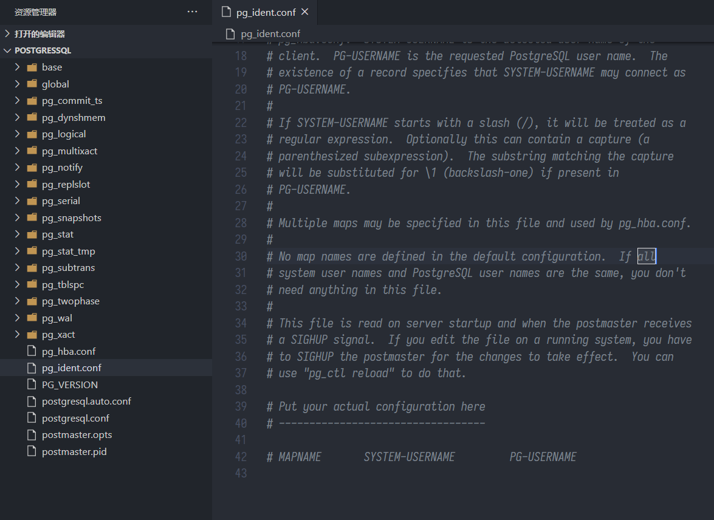
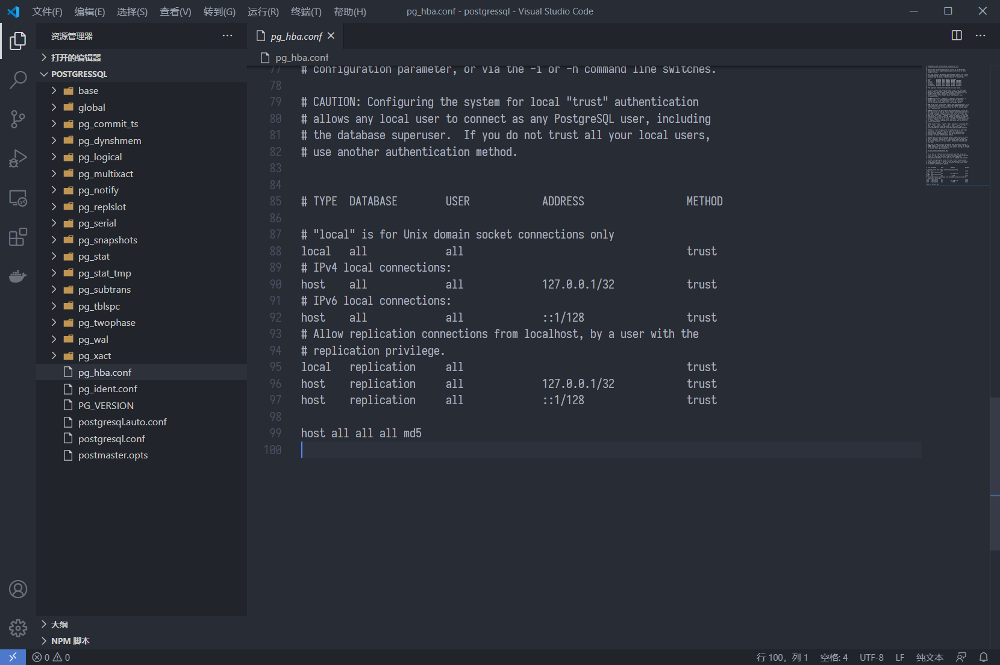
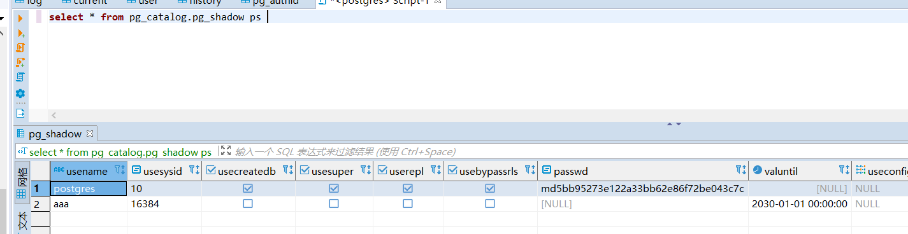
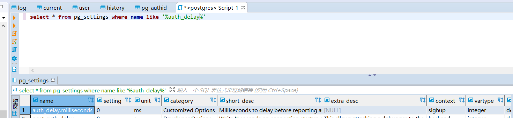
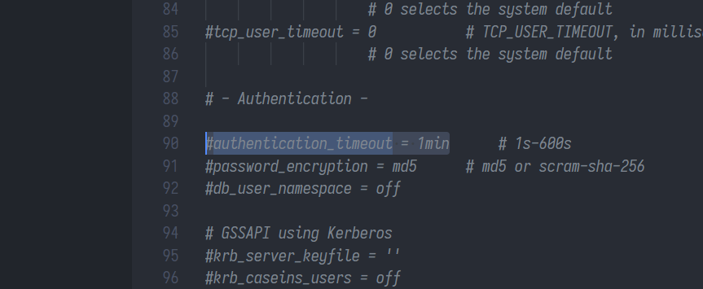
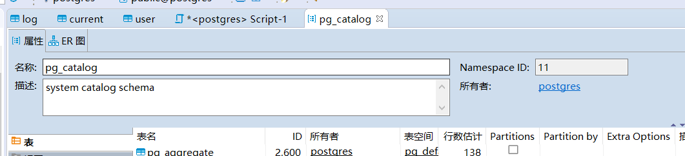
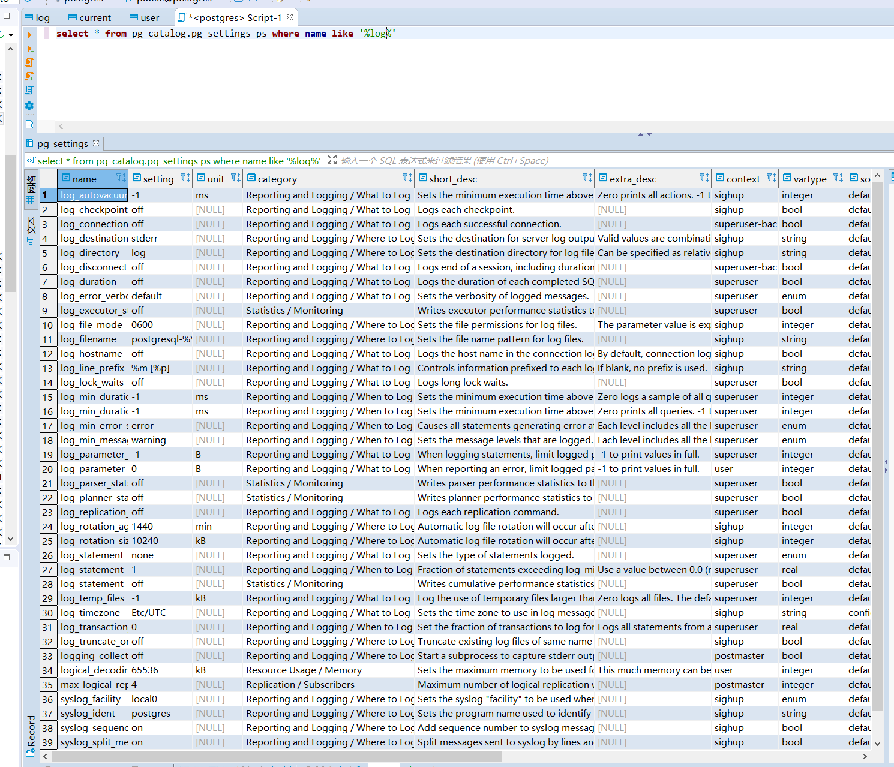
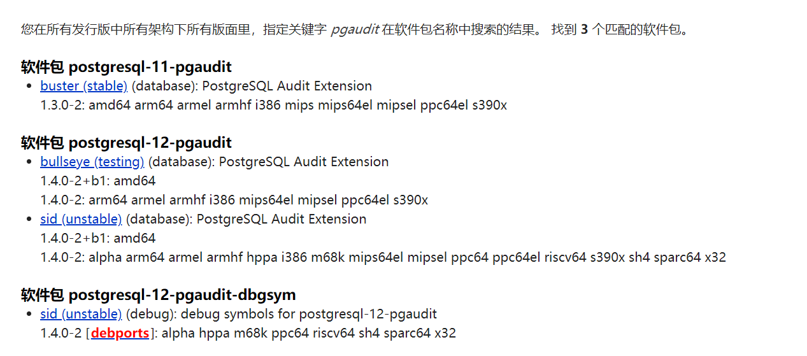
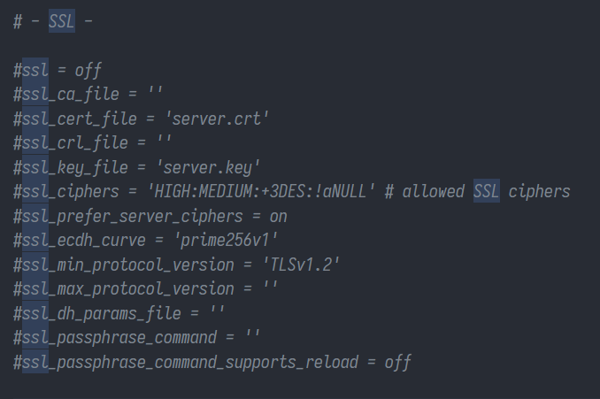

PostgreSQL
==========

身份鉴别
--------

鉴别模型
~~~~~~~~

PostgreSQL采用一种名为Host Based
Authentication的方式对所有登录客户端进行身份认证，操作系统中的 ``pg_hba.conf`` 文件定义了允许登录的客户端IP、连接方式等。此外，对于PostgreSQL而言，不同的数据库之间帐户完全独立， ``pg_hba.conf`` 可以通过database字段控制客户端允许连接哪个数据库。

``pg_hba.conf`` 中可以存放多行记录，当一个客户端向服务端发起连接请求时，服务端在 ``pg_hba.conf`` 文件中自上而下地匹配每一行记录。第一条同时匹配连接类型、客户端地址、连接用户的记录将被用于执行认证。

.. important::

   -  认证过程没有“落空”或者“后备”的说法：如果 ``pg_hba.conf`` 选择了一条记录而且认证失败，那么将不再考虑后面的记录。

   -  如果没有匹配的记录，那么访问将被拒绝。

之后服务端采用以下方式验证鉴别信息的有效性：

-  如果采用\ **信任认证**\ ，服务端不校验客户端的鉴别信息并直接放行。信任认证包含trust和ident两种情况，下方详解。

-  如果采用口令类的认证方式，服务端根据设定的认证方式，将客户端发送的鉴别信息与对应数据库中 ``pg_catalog.pg_authid`` 表中的记录进行比对。

-  如果采用第三方认证（ldap、pam等），服务端向认证提供方进行数据通信以获取认证结果。

信任认证
~~~~~~~~

PostgreSQL提供了一种信任认证的机制，可以在特定环境下，完全信任客户端向服务端发起的连接，并无需客户端提供鉴别信息。其中trust方式为无条件信任客户端，ident/peer方式为信任客户端的指定用户。

ident/peer方式实际上建立了一组“操作系统帐户-数据库帐户”映射，并将这个映射关系保存在服务端的 ``pg_ident.conf`` 文件中，如果客户端当前登录的操作系统帐户位于映射关系内，则可以直接以指定帐户登录数据库。注意 ``pg_ident.conf`` 只保存映射关系，而允许连接哪个数据库由 ``pg_hba.conf`` 控制。

此外，ident方式用于校验TCP/IP连接，peer方式用于校验local连接。当客户端向服务端发起TCP/IP的ident连接请求时，服务端从客户端的ident服务器（需要额外安装，默认监听113端口）处获取客户端的当前操作系统用户名。而客户端向服务端发起local的ident连接请求时，服务端直接通过syscall获取用户名。

pg_ident.conf默认在$PGDATA目录（ ``/var/lib/postgresql/data/`` ）下，其每一行格式为：

.. code-block::

   MAPNAME SYSTEM-USERNAME PG-USERNAME

   # 实现root->postgres的映射
   mymap   root            postgres

其中MAPNAME仅用作标识，可任意设置名字。之后在 ``pg_hba.conf`` 中使用 ``ident map=MAPNAME`` 的方式调用规则。

|image1|

pg_hba.conf
~~~~~~~~~~~

pg_hba.conf默认在$PGDATA目录下，其每一行格式为：

.. code-block::

   TYPE     DATABASE    USER        ADDRESS        AUTH-METHOD [auth-options]

   # 允许postgres通过 Unix Socket 免密码登录
   local    postgres    postgres                   trust

   # 允许postgres通过loop地址登录
   host     postgres    postgres    127.0.0.1/32   md5

   # postgres在指定地址，操作系统当前帐户为root时，允许免密码登录
   host     postgres    postgres    10.10.20.30/32 ident map=mymap

   # 允许postgres通过指定地址，采用SSL登录
   hostssl  postgres    postgres    10.10.10.0/24  scram-sha-256

|image2|

type可选值如下：

-  local：匹配使用 Unix 域套接字的连接。

-  host：匹配使用 TCP/IP 建立的连接（同时允许SSL或非SSL）。

-  hostssl：匹配使用SSL加密的 TCP/IP 建立的连接。

-  hostnossl：匹配不使用SSL加密的 TCP/IP 建立的连接。

-  hostgssenc：匹配使用GSSAPI加密建立的TCP/IP连接。

-  hostnogssenc：匹配不使用GSSAPI加密建立的TCP/IP连接。

auth-method可选值如下：

-  trust：无条件地允许连接。

-  reject：无条件地拒绝连接。

-  scram-sha-256：执行SCRAM-SHA-256认证来验证用户的口令。

-  md5：执行SCRAM-SHA-256或MD5认证来验证用户的口令。

-  password：使用未加密的口令进行认证。\ **（不应使用该方式）**

-  gss：用 GSSAPI 认证用户。

-  sspi：用 SSPI 来认证用户。只在 Windows 上可用。

-  ident：通过联系客户端的 ident
   服务器获取客户端的操作系统名，并且检查它是否匹配被请求的数据库用户名。Ident
   认证只能在 TCIP/IP 连接上使用。当为本地连接指定这种认证方式时，将用
   peer 认证来替代。

-  peer：从操作系统获得客户端的操作系统用户，并且检查它是否匹配被请求的数据库用户名。这只对本地连接可用。

-  ldap：使用LDAP服务器认证。

-  radius：用 RADIUS 服务器认证。

-  cert：使用 SSL 客户端证书认证。

-  pam：使用操作系统提供的可插入认证模块服务（PAM）认证。

-  bsd：使用由操作系统提供的 BSD 认证服务进行认证。

口令复杂度
~~~~~~~~~~

PostgreSQL在contrib中预编译了一个插件passwordcheck，并预置了复杂度策略，如果要调整策略的话必须修改\ `contrib/passwordcheck/passwordcheck.c <https://github.com/postgres/postgres/blob/master/contrib/passwordcheck/passwordcheck.c>`__\ ，并重新编译（没人会这么干吧）。预置的复杂度策略为：

-  最少8个字符

-  必须包含数字和字母

-  不能含有用户名

核查时只需要在 ``pg_settings`` 表中查看 ``shared_preload_libraries`` 变量，确认是否包含passwordcheck即可。

|image3|

修改有两种方法（都需要重启）：

-  在system变量 ``shared_preload_libraries`` 的最后附加passwordcheck；

-  在postgresql.conf文件中修改 ``shared_preload_libraries`` 参数，增加passwordcheck；

口令有效期
~~~~~~~~~~

PostgreSQL没有口令复杂度全局默认值，必须在创建每个帐户时手动设置 ``valid until`` 值。核查时只需查看 ``pg_shadow`` 表即可。

|image4|

登录失败处理
~~~~~~~~~~~~

PostgreSQL在contrib中预编译了插件 ``auth_delay`` ，对于登录失败的连接行为，服务端延迟一段时间之后返回结果。加载该插件之后设置系统变量 ``auth_delay.milliseconds`` 可以实现登录延时。

|image5|

连接超时
~~~~~~~~

查看配置文件或系统变量中的 ``authentication_timeout`` 参数。

|image6|

.. important::

   PostgreSQL没有空闲会话超时功能。

核查命令
~~~~~~~~

.. code-block:: sql

   --查看数据库的帐户、口令加密、口令过期
   select * from pg_catalog.pg_shadow;

   --查看shared_preload_libraries配置内容
   select * from pg_settings where name = 'shared_preload_libraries';

   --查看auth_delay配置内容
   select * from pg_settings where name like '%auth_delay%';

访问控制
--------

权限模型
~~~~~~~~

PostgreSQL中，帐户与角色的概念等同，帐户可以视作拥有登录权限的角色，所有授权的主体均为角色级。PostgreSQL的权限分为系统级别权限和对象级别权限，其中系统级别权限包括LOGIN、CREATEDB、CREATEROLE、PASSWORD等一些强大的命令，对象级别权限包括SELECT、INSERT、UPDATE、DELETE、RULE、REFERENCES、TRIGGER、CREATE、TEMPORARY、EXECUTE、USAGE等对象操作权限。

PostgreSQL的各权限可以直接授予，也可以通过角色继承。继承的概念为：使用 ``grant roleA to roleB`` 命令，将角色A赋予角色B之后，角色B将会继承角色A的相应权限。其中每个角色有一个与继承相关的“Inherit”属性，控制其继承权限的方式。在上述情况下，如果角色B的该属性为“True”，那么角色B将自动叠加角色A的所有权限，反之角色B必须通过 ``set role roleA`` 命令手动切换角色后，方能使用继承过来的权限。

.. important::

   所有系统级别权限（LOGIN、CREATEDB、CREATEROLE、PASSWORD等）均无法自动继承，必须进行切换角色操作。

此外，进行赋权操作时，可以控制目标角色是否能将权限进行转授。注意授予转授权限时用的命令为 ``WITH GRANT OPTION`` ，授予转授角色时用的命令为 ``WITH ADMIN OPTION`` ，两者功能相同。

模式
~~~~

PostgreSQL中，数据库的下一级对象固定为模式（Schema），模式包含表、视图、索引、存储过程等。创建模式时，必须为其设置一个所有者角色。所有者角色和SUPERUSER权限具有模式的完全控制权，而其他角色必须得到授权后才可访问模式中的内容。

|image7|

系统权限
~~~~~~~~

=========== =======================================
权限名      描述
=========== =======================================
LOGIN       具有登录权限
SUPERUSER   超级用户，具有登录以外的所有系统权限
REPLICATION 拥有REPLICATION权限（即角色能启动复制）
CREATEDB    创建数据库权限
CREATEROLE  创建role权限
PASSWORD    设置密码
=========== =======================================

预置角色
~~~~~~~~

PostgreSQL提供一组默认角色，
他们可以访问特定的、通常需要的特权功能和信息。 管理员可以将这些角色
GRANT 给用户或其环境中的其他角色，
为这些用户提供对指定功能和信息的访问权限。这些默认角色默认都是不可登录的。

+---------------------------+-----------------------------------------+
| 角色名                    | 描述                                    |
+===========================+=========================================+
| read_all_settings         | 阅读所有配置变量，                      |
|                           | 即使那些通常只对超级用户可见的配置变量  |
+---------------------------+-----------------------------------------+
| pg_read_all_stats         | 阅读                                    |
|                           | 所有pg_stat_*视图并使用各种统计相关的扩 |
|                           | 展，甚至那些通常只对超级用户可见的扩展  |
+---------------------------+-----------------------------------------+
| pg_stat_scan_tables       | 执行可能对表进行可能需要很长时间ACCESS  |
|                           | SHARE锁定的监视功能                     |
+---------------------------+-----------------------------------------+
| pg_signal_backend         | 给其他后端发送信号(比如:                |
|                           | 取消查询、终止)                         |
+---------------------------+-----------------------------------------+
| pg_monitor                | 读取/执行各种监视视图和函数             |
+---------------------------+-----------------------------------------+
| pg_read_server_files      | 读取数据库服务器的文件                  |
+---------------------------+-----------------------------------------+
| pg_write_server_files     | 向数据库服务器文件系统写入              |
+---------------------------+-----------------------------------------+
| pg_execute_server_program | 执行数据库服务器上的文件                |
+---------------------------+-----------------------------------------+
| public                    | （隐藏）指代所有角色                    |
+---------------------------+-----------------------------------------+

.. _核查命令-1:

核查命令
~~~~~~~~

.. code-block:: sql

   -- 直接看5张权限视图就行
   -- 看不完的，非常长
   select * from information_schema.role_table_grants;
   select * from information_schema.role_column_grants;
   select * from information_schema.role_routine_grants;
   select * from information_schema.role_usage_grants;
   select * from information_schema.role_udt_grants;

   --需要特别注意public被授予的权限，应尽量回收不必要的表权限、视图权限和函数权限
   select * from information_schema.role_table_grants where grantee = 'PUBLIC';

安全审计
--------

日志收集器
~~~~~~~~~~

PostgreSQL自带日志收集器功能，日志存放在操作系统文件中。日志相关参数都可以通过变量修改，如果配置有效，能够起到完善的安全审计作用，只是无法实现按需设置审计对象。但对于分布式架构来说，日志内容会分散在各个节点上，无法判断某个操作是在哪个节点上执行的。所以，日志收集器不适用于PG的分布式架构。

主要变量
^^^^^^^^

日志收集器的变量一共30多个，主要的变量如下：

-  ``logging_collector`` （是否开启日志收集功能），\ **默认关闭**\ ；

-  ``log_line_prefix`` （日志字段）；推荐配置为'%m %p %u %d %r %h'（用户、时间、数据库、IP地址）；

-  ``log_directory`` （日志文件位置），默认为$PGDATA/log；

-  ``log_statement`` （记录哪些SQL语句）；

   -  ``none`` ：不记录；

   -  ``ddl`` ：记录所有数据定义命令，比如CREATE,ALTER,和DROP 语句；

   -  ``mod`` ：记录所有ddl语句，加上数据修改语句INSERT,UPDATE等；

   -  ``all`` ：记录所有执行的语句；

-  ``log_rotation_age`` （单个日志文件的rotate周期），默认1天；

-  ``log_rotation_size`` （单个日志文件的rotate大小），默认10MB；

-  ``log_connections`` （是否记录连接日志）

-  ``log_disconnections`` （是否记录连接断开日志）

-  ``log_destination`` （日志输出位置），包括stderr、csvlog、syslog、eventlog(Windows)；

|image8|

pg_audit
~~~~~~~~

日志收集器有一个缺点，即一旦开启就会收集所有符合要求的日志。无法根据实际审计需求，指定需要审计的对象。因此pgaudit项目组开发了一个独立的审计插件，能够由管理员通过插件设置自行定义审计对象。

pgaudit提供了会话审计和对象审计两种功能，其中：

-  会话审计和日志收集器功能类似，可针对特定类型的操作进行日志记录，其审计对象为数据库全局。其主要变量为pgaudit.log。

-  对象审计可以对特定审计对象的特定操作进行日志记录。对于pgaudit而言，对象审计由一个特殊的“审计角色”来实现。配置审计功能时，通过 ``pgaudit.role`` 变量绑定一个特殊的角色，之后pgaudit会针对该角色所拥有的所有对象权限进行审计。比如，向审计角色赋予tableA的select权限后，所有针对tableA的select操作都会记录日志。

.. important::

   pg_audit代替的功能为 ``log_statement`` ，其产生的审计日志还是发送至日志收集器。因此依然需要打开日志收集器，并合理配置 ``log_line_prefix`` 、 ``log_destination`` 等参数。

PostgreSQL默认不包含pg_audit插件，需自行下载 `pgaudit/pgaudit <https://github.com/pgaudit/pgaudit>`_ ，加入contrib后重新编译。此外，Debian/Ubuntu/CentOS的官方repo中包含少量预编译的pgaudit软件包，如果数据库版本匹配的话可直接下载安装。

|image9|

.. _主要变量-1:

主要变量
^^^^^^^^

-  ``pgaudit.log`` （会话审计）；设置内容可以包括操作符如“ALL, -MISC”，具体值如下：

   -  ``READ`` ：SELECT 和COPY 操作；

   -  ``WRITE`` ：INSERT, UPDATE, DELETE, TRUNCATE等操作；

   -  ``FUNCTION`` ：函数调用和 DO 块；

   -  ``ROLE`` : 与角色和特权相关的语句: GRANT、REVOKE、CREATE/ALTER/DROP ROLE；

   -  ``DDL`` ：不包含在ROLE类中的所有DDL；

   -  ``MISC`` ：其他的一些命令, 比如DISCARD、FETCH、CHECKPOINT、VACUUM等；

   -  ``ALL`` ：所有操作；

-  ``pgaudit.log_catalog`` （是否记录对pg_catalog的日志）

-  ``pgaudit.log_client`` （日志是否对客户端进程可见）

-  ``pgaudit.log_level`` （log_client的级别）

-  ``pgaudit.log_parameter`` （在每条日志后额外输出的字段）

-  ``pgaudit.log_relation`` （是否应该为SELECT或DML语句中引用的每个关系(表、视图等)创建单独的日志条目）

-  ``pgaudit.log_statement_once`` （操作包含子语句时，是否记录每个子语句的条目）

-  ``pgaudit.role`` （对象审计的绑定角色）

.. _核查命令-2:

核查命令
~~~~~~~~

.. code-block:: sql

   -- 查看日志收集器的具体参数配置
   select name,setting from pg_settings where name like 'log%';

   -- 查看是否部署了pgaudit插件
   select * from pg_available_extensions where name like '%audit%';

   -- 查看pgaudit插件的具体参数配置
   select name,setting from pg_settings where name like 'pgaudit%';

安全通信
--------

PostgreSQL预编译了OpenSSL模块，可用于通信SSL/TLS连接。若要开启SSL，需要在conf文件中配置 ``ca_file`` 、 ``cert_file`` 、 ``key_file`` 等参数，加载有效的SSL证书。注意相关文件的权限不能超过600，否则PostgreSQL将拒绝加载证书并中止启动过程。此外，也可以设置SSL/TLS的协议、算法等安全性参数。

|image10|

配置成功之后，在查询中输入 ``show ssl`` 即可查看SSL状态。之后就可以修改 ``pg_hba.conf`` ，限制客户端仅可通过SSL登录（hostssl）。

.. |image3| image:: media/pg/image3.png
   :width: 5.76806in
   :height: 1.46111in

