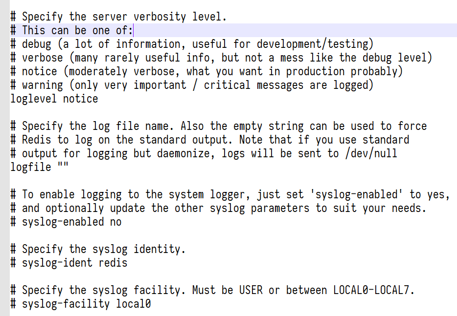

Redis
=====

- 维护者

   - Redis Labs

- 是否免费

   - Redis：免费&开源

   - Redis Enterprise Software：收费&服务

- Latest Release

   - `redis.io <https://redis.io/download>`_

----

.. contents::

----

身份鉴别
--------

Redis在设计之初就没有注重用户鉴权及访问控制，导致其安全性天生不符合等保要求。但相对地，Redis一直在向极致效率和极致性能发展。Redis配置非常简单，所有参数均集中在一个conf文件。

如果业务需求一般的话，甚至不需要自定义配置，使用默认配置直接启动都可以，基本实现了开箱即用。

Redis密码
~~~~~~~~~

6.0版本之前的Redis仅靠配置文件的 ``requirepass`` 参数实现鉴别认证，且pass为明文保存在配置文件中。设置了pass参数后，客户端在连接数据库时，必须进行认证操作 ``AUTH pass`` 。特别地，Redis多节点同步的情况下，需要在每个从节点中额外配置 ``masterauth`` 参数。

|image1|

|image2|

ACL认证
~~~~~~~

Redis发展到6.0版本后，维护者终于憋出来一个半残废的ACL功能，可以为每个ACL帐户设置独立的口令（口令采用SHA256方式保存）。妥善配置ACL帐户后，客户端采用 ``AUTH user pass`` 的方式进行身份认证。Redis多节点同步的情况下，可在每个从节点中配置 ``masteruser`` 及 ``masterauth`` 参数，实现不同从节点的独立鉴权。

为了保持向下兼容性，Redis预置default帐户， ``requirepass`` 参数及 ``AUTH pass`` 命令依然有效。但实际上， ``requirepass`` 参数设置的是default帐户的口令， ``AUTH pass`` 等同于 ``AUTH default pass`` 。

会话超时
~~~~~~~~

conf文件中配置 ``timeout`` 参数即可。

|image3|

保护模式
~~~~~~~~

Redis自带了一个保护机制，防止管理员误操作导致的数据泄露。当Redis未设置密码且绑定了所有网络接口，则自动启动保护模式，仅允许环回地址及Unix Socket访问。

|image4|

访问控制
--------

很可惜，6.0版本之前的Redis没有任何访问控制机制，一切全靠配置文件的pass参数。

命令重命名（6.0前）
~~~~~~~~~~~~~~~~~~~

在配置文件中可以重命名系统命令，参数格式为 ``rename-command <cmd> <dstStr>`` 。比如将 ``CONFIG`` 命令重命名为 ``b840fc02d524045429941cc15f59e41cb7be6c52`` ，勉强起到部分访问控制作用。

.. hint::

   如果将命令重命名为空，则等同于禁用该命令。

ACL（6.0后）
~~~~~~~~~~~~

6.0版本后的Redis提供了ACL功能，具体配置方法可参照\ `官方文档 <https://redis.io/commands/acl-setuser>`__\ 。可以为每个用户独立限制其允许使用的命令，限制允许访问的key（业务数据）。在数据库中输入 ``ACL LIST`` 可查看ACL帐户列表，其参数为：user/用户名/用户状态(on/off)/密码/键权限/命令权限。

|image5|

|image6|

如前文所述，为了保持向下兼容性，Redis存在默认帐户default。该帐户不得删除，可通过 ``requirepass`` 参数设置口令，可以对其设置ACL策略，甚至去除所有权限。

|image7|

特别地，在缺省参数创建帐户时（ ``ACL SETUSER test`` ），该帐户默认有所有命令权限、没有键权限、没有密码、状态off。

|image8|

安全审计
--------

很可惜，Redis甚至没有称得上安全审计的机制。

Redis log
~~~~~~~~~

Redis默认记录服务器日志，日志级别为 ``notice`` （能够记录大部分系统事件，但任何级别都不能记录操作）。

|image9|

如果没有在conf中配置的话，默认输出到 ``/dev/null`` 。因此需要配置 ``logfile`` 参数，实现日志的本地保存。并可以配置输出日志到syslog。

|image10|

越权操作日志ACL LOG
~~~~~~~~~~~~~~~~~~~

仅记录ACL鉴权失败（用户越权操作）的日志，仅记录一级命令，如对 ``ACL LIST`` 的越权操作仅记录"ACL"。ACL LOG以链表形式存放在内存中，不写文件，无法做到日志持久化。

ACL日志的字段包括：类型（key或者command）、客户端IP、时间戳、用户、一级操作。

|image11|

conf中可以设置这个链表的最大长度（日志最大数量）

|image12|

Monitor
~~~~~~~

Monitor是Redis的一个命令，能够记录所有对Redis的操作，对应实现函数为 ``redis-cli.c->cliReadReply()`` 。

|image13|

该命令默认仅能回显对服务器的所有操作，不记录用户，不写日志文件，且必须保持Monitor的终端打开，不能起到审计作用。Monitor的回显内容包括：时间戳、会话id、会话端口、命令内容。

|image14|

安全通信
--------

Redis支持TLS/SSL通信加密，也支持X509双向认证。只需要查看conf文件中关于TLS/SSL的相关参数即可（注意观察端口参数是 ``port`` 还是 ``tls-port`` ）

|image15|

.. |image3| image:: media/redis/image3.png
   :width: 5.76806in
   :height: 0.87847in
.. |image4| image:: media/redis/image4.png
   :width: 5.76806in
   :height: 3.30069in

.. |image6| image:: media/redis/image6.png
   :width: 5.76806in
   :height: 2.11597in
.. |image7| image:: media/redis/image7.png
   :width: 5.76806in
   :height: 1.35764in
.. |image8| image:: media/redis/image8.png
   :width: 5.76806in
   :height: 1.56319in
.. |image9| image:: media/redis/image9.png
   :width: 5.76806in
   :height: 4.575in

.. |image12| image:: media/redis/image12.png
   :width: 5.76806in
   :height: 1.55694in

