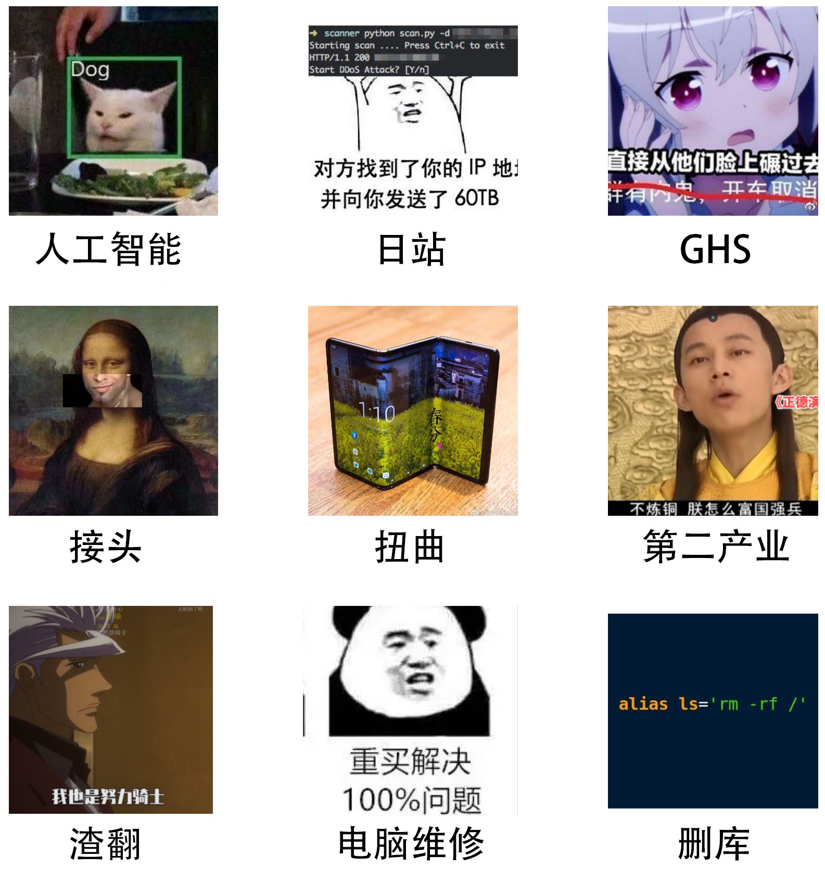

README
===============

本项目主要包含学习笔记，以及从五湖四海白嫖来的文章（logo也是偷来的）。

AND 博主很懒，日常不更

AND 学习，学个屁

部署信息
~~~~~~~~~~~~~~~

线上环境
---------------

目前项目在两个地方部署了线上环境：

- `GitHub Pages <https://ale10bb.github.io/blog/>`_ （众所周知，GitHub很慢）
- `白嫖的服务器 <https://www.chenqlz.top>`_ （被查了可能就下线了）

本地部署
---------------

docker image
^^^^^^^^^^^^^^^

registry地址：

- registry.cn-shanghai.aliyuncs.com/ale10bb/blog

创建本地容器：

.. code-block:: bash

   docker run -d --name blog -p 80:80 registry.cn-shanghai.aliyuncs.com/ale10bb/blog

pre-build branch (gh-pages)
^^^^^^^^^^^^^^^^^^^^^^^^^^^^^^

repo地址：

- `ale10bb/blog <https://github.com/ale10bb/blog>`_

.. code-block:: bash

   git clone https://github.com/ale10bb/blog.git
   cd blog
   git checkout gh-pages

build from src
^^^^^^^^^^^^^^^^

你可以自行安装requirements后编译，编译输出位于 ``build\html`` 。

.. code-block:: 

   git clone https://github.com/ale10bb/blog.git
   python -m venv sphinx-build
   sphinx-build\Scripts\activate
   pip install -r blog\requirements.txt
   blog\make
   deactivate

LICENSE
~~~~~~~~~~~~~~~

1. 在本项目中，您将不可避免地看到奇怪内容。对于因承受能力不足而造成的语塞、受惊、口吐白沫等情况，我方不提供心理疏导服务及救治服务。
2. 知识无界，觉得有用的话不如分享一下。觉得博主在放屁的话，请顺着网线去打他。

---------------

附：奇怪内容清单

致谢
~~~~~~~~~~~~~~~

ReST的语法和格式受 `[野火]sphinx文档规范与模版 <https://ebf-contribute-guide.readthedocs.io/zh_CN/latest/>`_ 大量启发，在此向项目组表示谢意。
